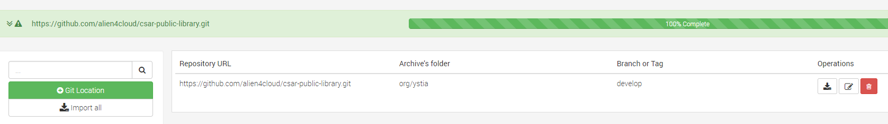

##################
Ystia CSAR library
##################

.. contents::
	:local:
	:depth: 4

.. *********************************************************************************************************************

.. _introduction_section:

************
Introduction
************

Ystia CSAR library overview
===========================

**Ystia CSAR libray** provides TOSCA Components and Topology templates to easily create Big Data application clusters on demand.
Deployment of Big Data applications can be done on a public Cloud (such as Amazon), or on a private cloud (such as OpenStack), on Bare-Metal or on HPC.

The TOSCA Components and Topology templates currently contained in this repository can be used to construct different application categories :

- **Log Analysis** applications based on Elastic_ components and on the Kafka_ message broker

- Applications using MySQL_ database server,

- Stream processing development and execution environment based on Flink_

- Data science development and execution environments (RStudio_, Jupyter_)

- Moreover, technical components such as *Java* and Consul_ (Consensus Systems), allow detailed application architectures to be designed.

The components are connected together in application topologies.
To simplify topology creation, Ystia provides **topology templates** that can be extended by your applications.

.. _Cloudera: https://www.cloudera.com/
.. _Consul: https://www.consul.io/
.. _Elastic: https://www.elastic.co/products
.. _Flink: https://flink.apache.org/
.. _Hortonworks: https://hortonworks.com/
.. _Jupyter: http://jupyter.org/
.. _Kafka: https://kafka.apache.org/
.. _MapR: https://mapr.com/
.. _MongoDB: https://www.mongodb.com/
.. _MySQL: http://www.mysql.com/
.. _Nifi: https://nifi.apache.org/
.. _PostgreSQL: https://www.postgresql.org/
.. _RStudio: https://www.rstudio.com/

.. *********************************************************************************************************************
.. _getting_started_section:

***************
Getting Started
***************

    This section describes how to set up a basic application cluster using Ystia components.

Ystia contains the following products:

- Alien4Cloud_, provides the Ystia Studio for the end-users. It allows them to define application architectures and to deploy those applications on pre-configured locations.
- Janus_, provides the Ystia Orchestrator, an engine allowing to orchestrate application deployment.

.. _Janus: http://TO_BE_COMPLETED/
.. _Alien4Cloud: http://alien4cloud.github.io/

.. _getting_started_requirements_section:

Requirements
============

To create and run application using YSTIA CSAR library components requires :

- A running instance of **Janus**
- A running instance of **Alien4Cloud**
- The components and topology templates from the **Ystia CSAR Library** must be imported to the Alien4Cloud catalog.

.. _getting_started_build_section:

How to import Ystia Forge components in the catalog
===================================================

There are two possibilities to import the Ystia Forge components and topology templates in the catalog:

#. Build a CSAR archive for every necessary components and topologies, then upload them in a precise order based on the possible dependencies between them.
#. Import all the Ystia components and topologies hosted in the present repository using the Alien4Cloud's *CSAR Git Integration*.

For the first method, see the example provided below for the *Welcome* sample.

For the second method,

- you need to define the Git repository of Ystia Forge in the *Components* view of Alien4Cloud,

  - Repository URL: https://github.com/alien4cloud/csar-public-library.git
  - Credentials: *none*
  - Tag: **TO BE DEFINED**
  - Archive to import: **org/ystia**

- and then execute the import operation.

Using this second method, dependencies are automatically resolved when importing CSARs with *Git integration*.

Finally, you can browse the archives list, but also the components and the topologies list to check that all the Ystia Forge is uploaded.

.. _getting_started_samples_section:

Welcome sample
==============

The **Welcome** Ystia component is a very sample HTTP server.
It can be used to create and deploy your first Alien4Cloud application and to check the Ystia installation.

Detailed information can be found under:

- **org/ystia/samples/welcome** and
- **org/ystia/samples/topologies/welcome_basic**

Generate CSARs for Welcome sample
---------------------------------

Suppose that none of the necessary components, nor topology template are uploaded to the Alien4CLoud catalog.
You have to generate CSARs for :

- common and welcome components
- welcome_basic topology

::

  $ cd YOUR_SANDBOX/csar-public-library/org/ystia/common
  $ zip -r common-csar.zip *
  $ cd YOUR_SANDBOX/csar-public-library/org/ystia/samples/welcome/linux/bash
  $ zip -r welcome-csar.zip *
  $ cd YOUR_SANDBOX/csar-public-library/org/ystia/samples/topologies/welcome
  $ zip -r welcome_basic-csar.zip *

Then you have to upload the generated archives to the Alien4Cloud catalog by drag and drop respecting following order:

#. **common-csar.zip**
#. **welcome-csar.zip**
#. **welcome_basic-csar.zip**

Finally, you can browse the archives list, but also the components and the topologies list, to check that the uploaded elements are presented:

- ``org.ystia.common`` ``Root``, ``SoftwareComponent``, ``DBMS`` and ``Database`` Components
- ``org.ystia.samples.welcome.linux.bash.Welcome`` component
- ``org.ystia.samples.welcome_basic`` topology

.. *********************************************************************************************************************

.. _topologies_section:

**********
Topologies
**********

    Ystia provides various topology templates, which can be used for demos, development or production applications.

.. _topologies_elk_section:

Topologies for Log Analysis based on Elastic Stack
==================================================

+-------------------+----------------------------------------------+
| **elk_basic**     | *org/ystia/topologies/elk_basic*             |
+-------------------+----------------------------------------------+
| **elk_broker**    | *org/ystia/topologies/elk_broker*            |
+-------------------+----------------------------------------------+
| **elk_ha**        | *org/ystia/topologies/elk_ha*                |
+-------------------+----------------------------------------------+
| **elk_geonames**  | *org/ystia/topologies/elk_geonames*          |
+-------------------+----------------------------------------------+

+-------------------+----------------------------------------------+
| **elk_beats**     | *org/ystia/samples/topologies/elk_beats*     |
+-------------------+----------------------------------------------+
| **elk_heartbeat** | *org/ystia/samples/topologies/elk_heartbeat* |
+-------------------+----------------------------------------------+
| **elk_dummylogs** | *org/ystia/samples/topologies/elk_dummylogs* |
+-------------------+----------------------------------------------+
| **elk_nifi**      | *org/ystia/samples/topologies/elk_nifi*      |
+-------------------+----------------------------------------------+
| **elk_twitter**   | *org/ystia/samples/topologies/elk_twitter*   |
+-------------------+----------------------------------------------+

Topologies for Flink
====================

+-----------+------------------------------+
| **flink** | *org/ystia/topologies/flink* |
+-----------+------------------------------+

.. *********************************************************************************************************************

.. _components_section:

**********
Components
**********

Consensus systems
=================

+------------+--------------------+
| **Consul** | *org/ystia/consul* |
+------------+--------------------+

ELK components
==============

+-------------------+---------------------------+
| **Elasticsearch** | *org/ystia/elasticsearch* |
+-------------------+---------------------------+
| **Logstash**      | *org/ystia/logstash*      |
+-------------------+---------------------------+
| **Kibana**        | *org/ystia/kibana*        |
+-------------------+---------------------------+
| **Beats**         | *org/ystia/beats*         |
+-------------------+---------------------------+

Geolocation components
======================

+--------------+----------------------+
| **GeoNames** | *org/ystia/logstash* |
+--------------+----------------------+

Social network connectors
=========================

+----------------------+----------------------+
| **TwitterConnector** | *org/ystia/logstash* |
+----------------------+----------------------+

Message brokers
===============

+-----------+-------------------+
| **Kafka** | *org/ystia/kafka* |
+-----------+-------------------+
| **Nifi**  | *org/ystia/nifi*  |
+-----------+-------------------+

Stream & real-time processing
=============================

+-----------+-------------------+
| **Flink** | *org/ystia/flink* |
+-----------+-------------------+

Studios for data scientists
===========================

+-------------+---------------------+
| **Jupyter** | *org/ystia/jupyter* |
+-------------+---------------------+
| **RStudio** | *org/ystia/rstudio* |
+-------------+---------------------+

Database Servers
================

+-----------+-------------------+
| **MySQL** | *org/ystia/mysql* |
+-----------+-------------------+

Utilities
=========

+-------------+---------------------+
| **HAProxy** | *org/ystia/haproxy* |
+-------------+---------------------+
| **Java**    | *org/ystia/java*    |
+-------------+---------------------+
| **Python**  | *org/ystia/python*  |
+-------------+---------------------+
| **XFS**     | *org/ystia/xfs*     |
+-------------+---------------------+

.. *********************************************************************************************************************

.. _recovery_section:

********
Recovery
********

    This section describes how to recover manually Ystia components.
    This will be useful, for example, after a reboot of VMs that host Ystia components.

    The start/stop scripts of Ystia components are integrated as **services** into the Linux init system **systemd**.

Some Ystia components/services are automatically started at boot, while others are not.

Useful **systemd** basic commands:

- To start a service::

    $ sudo systemctl start <service-name>

- To stop a service::

    $ sudo systemctl stop <service-name>

- To get the status of a service, followed by most recent log data from the journal::

    $ sudo systemctl status <service-name>

- To show the messages for the service::

    $ journalctl -u <service-name>

  or::

    $ journalctl -u <service-name> --no-pager

Consul
======

The Consul component (agent and server) matches the **consul** systemd service.

The **consul** service is not started at boot.

The **consul** service corresponding to the server must be started first, then the **consul** services corresponding
to the agents can be started.

ELK and Kafka
=============

Elasticsearch
-------------

The Elasticsearch component matches the **elasticsearch** systemd service.

The **elasticsearch** service is not started at boot.

If the Elasticsearch component depends on a Consul agent, the associated **consul** service must be started first.

Logstash
--------

The Logstash component matches the **logstash** systemd service.

The **logstash** service is not started at boot.

If the Logstash component depends on a Consul agent, the associated **consul** service must be started first.

Kibana
------

The Kibana component matches two systemd services:

- **kibana** service
- **elasticsearch** service corresponding to the Elasticsearch client associated to Kibana.

When the **kibana** service is started, the **elasticsearch** service is automatically started.

When the **kibana** service is stopped, the **elasticsearch** service is not automatically stopped.

So, to start Kibana component, just start the **kibana** service. To stop Kibana component,
stop the **elasticsearch** service, then the **kibana** service .

The **kibana** service is not started at boot.

If the Kibana component depends on a Consul agent, the associated **consul** service must be started first.

Beats
-----

Each Beats component matches one systemd service :

- FileBeat: **filebeat** service
- PacketBeat: **packetbeat** service
- TopBeat: **topbeat** service

The beat services are not started at boot.

Kafka
-----

The Kafka component matches two systemd services:

- **zookeeper** service
- **kafka** service

To start Kafka component, start first the **zookeeper** service, then the **kafka** service.

To stop Kafka component, stop first the **kafka** service, then the **zookeeper** service.

The **zookeeper** and **kafka** services are not started at boot.

If the Kafka component depends on a Consul agent, the associated **consul** service must be started first.

For a Kafka cluster, **zookeeper** services must be started first on all the nodes of the cluster,
then **kafka** services can be started.

ELK topologies
--------------

For **elk-basic** topology, the start order of the services is the following:

- Start consul server on Compute_CS
- Start consul agents on Compute_ES, Compute_KBN, and Compute_LS
- Start elasticsearch service on Compute_ES
- Start kibana service on Compute_KBN (elasticsearch client service is automatically started)
- Sart logstash service on Compute_LS.

For **elk-broker** topology, the start order of the services is the following:

- Start consul server on Compute_CS
- Start consul agents on Compute_ES, Compute_KBN, Compute_KFK, Compute_LI and Compute_LS
- Start elasticsearch service on Compute_ES
- Start kibana service on Compute_KBN (elasticsearch client service is automatically started)
- Start zookeeper service, then kafka service on Compute_KFK
- Start logstash service on Compute_LI
- Start logstash service on Compute_LS.

For **elk-ha** topology:

- Mount the **LinuxFileSystem** on the nodes of Elasticsearch cluster and Kafka cluster. For example::

      $ sudo mount /dev/vdb1 /mountedStorageES
      $ sudo mount /dev/vdb1 /mountedStorageKFK

- Start services in the same order as for **elk-broker** topology except for Kafka cluster.
  Indeed, **zookeeper** services must be started first on all the nodes of the cluster,
  then **kafka** services can be started.

Studios for data scientists
===========================

RStudio
-------

The RStudio component matches the **rstudio-server** systemd service.

The **rstudio-server** service is automatically started at boot.

Jupyter
-------

The Jupyter component matches the **jupyter** systemd service.

The **jupyter** service is not started at boot.

.. *********************************************************************************************************************

.. _references_section:

**********
References
**********

Alien4Cloud documentation
  https://alien4cloud.github.io/#/documentation/1.4.0/index.html

Janus documentation
  https://TO_BE_COMPLETED

**TO BE COMPLETED.....**

