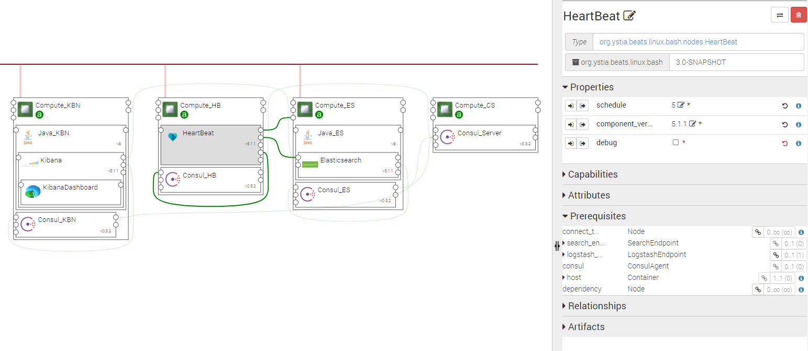

.. _beats_section:

***************
Beat components
***************

.. contents::
    :local:
    :depth: 3

Beat components are data shippers for sending different types of data to Logstash, or to Elasticsearch. These data can then be visualized in Kibana.

Currently in Ystia, the following Beats are available:

- **FileBeat** ships file contents (typically log files)
- **MetricBeat** ships metrics about process/system/filesystem
- **PacketBeat** ships information about network traffic
- **HeartBeat** monitors services and ships service availability information

FileBeat
--------

The following figure shows a FileBeat topology example.

.. image:: docs/images/FileBeat.png
   :name: FileBeat_figure
   :scale: 100
   :align: center

Properties
^^^^^^^^^^

- **component_version:** Version of the component.

- **files**: A coma separated list of files to monitor

  - Default: /var/log/\*.log
- **debug**: Enable debug logs for this beat. Logs are located under ~/<Component_Name>/beat.log

  - Default: false

Requirements
^^^^^^^^^^^^

- **host**: FileBeat component requires to be hosted on a Compute.
- **search_endpoint**: FileBeat component may be connected to ElasticSearch.
- **logstash_endpoint**: FileBeat component may be connected to Logstash.

****

**Notes**
  FileBeat component should be connected to at least one of ElasticSearch or Logstash.

  If FileBeat component is connected to ElasticSearch, it should also be connected to Consul in order to discover the ElasticSearch cluster. Exception: if FileBeat is on the same compute than ElasticSearch, Consul is not mandatory.

****

Artifacts
^^^^^^^^^

- **beat_bin**: Binary distribution of FileBeat. This artifact can be used to update FileBeat binaries to a newer version.
  Only the packaged version is supported, in *tar.gz* archive format.

- **beat_config**: Default configuration file. This artifact can be used to overwrite the default configuration for FileBeat. In this case, to keep the automatic connection to ElasticSearch, a placeholder *#ELASTIC_SEARCH_OUTPUT_PLACEHOLDER#* should be present
  in the configuration file where the ElasticSearch output configuration should be inserted. Likewise, for automatic connection to Logstash,
  a placeholder *#LOGSTASH_OUTPUT_PLACEHOLDER#* should be present. The files property of the component is inserted under the
  *#FILES_PLACEHOLDER#* placeholder as a YAML list.

- **scripts**: Beats required scripts.

- **consul_scripts**: Scripts required by the Consul component.

- **utils_scripts**: Common util scripts for whole Ystia components.

MetricBeat
----------

The following figure shows a MetricBeat topology example.

.. image:: docs/images/MetricBeat.png
   :name: TopBeat_figure
   :scale: 100
   :align: center

Properties
^^^^^^^^^^

- **component_version:** Version of the component.

- **period**: In seconds, defines how often to read server statistics.

  - Default: 10
- **debug**: Enable debug logs for this beat. Logs are located under ~/<Component_Name>/beat.log

  - Default: false

Requirements
^^^^^^^^^^^^

- **host**: MetricBeat component requires to be hosted on a Compute.

- **search_endpoint**: MetricBeat component may be connected to ElasticSearch.

- **logstash_endpoint**: MetricBeat component may be connected to Logstash.

****

**Notes**
  MetricBeat component should be connected to at least one of ElasticSearch or Logstash.
  If MetricBeat component is connected to ElasticSearch, it should also be connected to Consul in order to discover the ElasticSearch cluster. Exception: if TopBeat is on the same compute than ElasticSearch, Consul is not mandatory.

****

Artifacts
^^^^^^^^^

- **beat_bin**: Binary distribution of TopBeat. This artifact can be used to update TopBeat binaries to a newer version.
  Only the packaged version is supported, in *tar.gz* archive format.

- **beat_config**: Default configuration file. This artifact can be used to overwrite the default configuration for TopBeat. In this case, to keep the automatic connection to ElasticSearch, a placeholder *#ELASTIC_SEARCH_OUTPUT_PLACEHOLDER#* should be present
  in the configuration file where the ElasticSearch output configuration should be inserted. Likewise, for automatic connection to Logstash
  a placeholder *#LOGSTASH_OUTPUT_PLACEHOLDER#* should be present.

- **scripts**: Beats required scripts.

- **consul_scripts**: Scripts required by the Consul component.

- **utils_scripts**: Common util scripts for whole Ystia components.

PacketBeat
----------

The following figure shows a PacketBeat topology example.

.. image:: docs/images/PacketBeat.png
   :name: PacketBeat_figure
   :scale: 100
   :align: center

Properties
^^^^^^^^^^

- **component_version:** Version of the component.

- **device**: Select the network interfaces to sniff the data. You can use the 'any' keyword to sniff on all connected interfaces.

  - Default: any
- **debug**: Enable debug logs for this beat. Logs are located under ~/<Component_Name>/beat.log

  - Default: false

Requirements
^^^^^^^^^^^^

- **host**: PacketBeat component requires to be hosted on a Compute.

- **search_endpoint**: PacketBeat component may be connected to ElasticSearch.

- **logstash_endpoint**: PacketBeat component may be connected to Logstash.

****

**Notes**
  PacketBeat component should be connected to at least one of ElasticSearch or Logstash.
  If PacketBeat component is connected to ElasticSearch, it should also be connected to Consul in order to discover the ElasticSearch cluster. Exception: if PacketBeat is on the same compute than ElasticSearch, Consul is not mandatory.

****

Artifacts
^^^^^^^^^

- **beat_bin**: Binary distribution of PacketBeat. This artifact can be used to update PacketBeat binaries to a newer version.
  Only the packaged version is supported, in *tar.gz* archive format.

- **beat_config**: Default configuration file. This artifact can be used to overwrite the default configuration for PacketBeat. In this case, to keep the automatic connection to ElasticSearch, a placeholder *#ELASTIC_SEARCH_OUTPUT_PLACEHOLDER#* should be present
  in the configuration file where the ElasticSearch output configuration should be inserted. Likewise, for automatic connection to Logstash,
  a placeholder *#LOGSTASH_OUTPUT_PLACEHOLDER#* should be present.

- **scripts**: Beats required scripts.

- **component_version:** Version of the component.

- **consul_scripts**: Scripts required by the Consul component.

- **utils_scripts**: Common util scripts for whole Ystia components.

HeartBeat
----------

The Ystia HeartBeat component allows to monitor an application's services. It is able to get information about the services registered into Consul.
That's why applications that need service monitoring have to use both Consul and HeartBeat Ystia components.

The following figure shows a HeartBeat topology example.

Properties
^^^^^^^^^^

- **component_version:** Version of the component.

- **schedule**: defines the time period in seconds to check for service availability

  - Default: 5
- **debug**: Enable debug logs for this beat. Logs are located under ~/<Component_Name>/beat.log

  - Default: false

Requirements
^^^^^^^^^^^^

- **host**: HeartBeat component requires to be hosted on a Compute.

- **consul**: HeartBeat component requires to be connected to a Consul component which provides data about available services

- **search_endpoint**: HeartBeat component may be connected to ship data into ElasticSearch.

- **logstash_endpoint**: HeartBeat component may be connected to ship data into Logstash.

- **connect_ToComponent**: HeartBeat component requires to be connected to one of the application's components.

****

**Notes**
  HeartBeat component should be connected to at least one of ElasticSearch or Logstash
  HeartBeat component should be connected to Consul and to another application's components in order to obtain service availability information
****

Artifacts
^^^^^^^^^

- **beat_bin**: Binary distribution of HearttBeat. This artifact can be used to update HeartBeat binaries to a newer version.
  Only the packaged version is supported, in *tar.gz* archive format.

- **beat_config**: Default configuration file. This artifact can be used to overwrite the default configuration for HeartBeat. In this case, to keep the automatic connection to ElasticSearch, a placeholder *#ELASTIC_SEARCH_OUTPUT_PLACEHOLDER#* should be present
  in the configuration file where the ElasticSearch output configuration should be inserted. Likewise, for automatic connection to Logstash,
  a placeholder *#LOGSTASH_OUTPUT_PLACEHOLDER#* should be present.

- **scripts**: Beats required scripts.

- **component_version:** Version of the component.

- **consul_scripts**: Scripts required by the Consul component.

- **utils_scripts**: Common util scripts for whole Ystia components.
