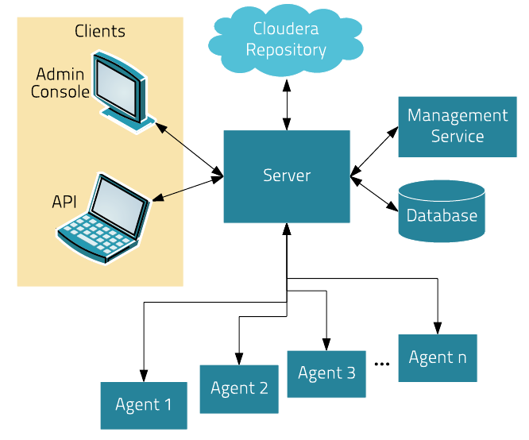
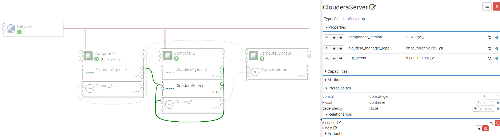
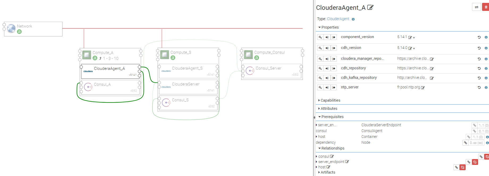

.. _cloudera_section:

********
Cloudera
********

.. contents::
    :local:
    :depth: 3

Cloudera Overview
------------------

**Cloudera Manager** is an end-to-end application for easily deploying and managing **Cloudera Distribution Hadoop (CDH)** clusters
(complete CDH stack and other managed services).

The **Cloudera Manager Server** is the heart of Cloudera Manager.
This Server hosts the Admin Console Web Server, and is responsible, together with the agents,
for installing software, configuring, starting and stopping services, and managing the cluster on which the services run.

The Cloudera Manager Server uses the following components:

- **Agent**: installed on every host, the agent starts and stops processes, unpack configurations, trigger installations, and monitor the host.

- **Management Service**: a set of roles that perform various monitoring, alerting, and reporting functions.

- **Database**: stores configuration and monitoring information.

- **Cloudera Repository**: software repository for distribution by Cloudera Manager.

- **Clients**: interfaces with the server:

  - **Admin Console**: Web-based UI used by administrators to manage clusters and Cloudera Manager.

  - **API**: used by developers to create custom Cloudera Manager applications.

Ystia provides two components for Cloudera, both being packed in the same Ystia CSAR:

#. **Cloudera Server**, which includes the Cloudera Manager Server and an embedded database, and runs on the main node.
#. **Cloudera Agent**, which includes the Cloudera Manager Agent, and runs on each cluster node.

Cloudera Server Component
-------------------------

Cloudera Server provides the Cloudera Manager Server with an embedded PostgreSQL database. It requires a CentOS 7 Linux system.

Attributes
^^^^^^^^^^

- **url**: URL of the Cloudera Manager Admin console (default user/password: admin/admin).

Properties
^^^^^^^^^^

- **component_version:** Version of the component.

- **cloudera_manager_repository** : Alternative download repository for Cloudera Manager Server.

  - Default : https://archive.cloudera.com/cm5/redhat/7/x86_64/cm/5.14.1/

- **ntp_server**: IP address or name of the NTP server to use.

  - Default : fr.pool.ntp.org

Requirements
^^^^^^^^^^^^

- **host**: Cloudera Server requires to be hosted on a Compute with **linux** type and **centos** distribution.

- **consul**: Cloudera Server must be connected to a Consul agent hosted on the same Compute.
  discovery.

Capabilities
^^^^^^^^^^^^

- **cloudera_server_endpoint**: Allows Cloudera agents to connect to this Cloudera server

Artifacts
^^^^^^^^^

- **data**: Data files for setting up the yum repositories files.

- **scripts**: Cloudera Server required scripts.

- **utils_scripts**: Common util scripts for whole Ystia components.

Cloudera Agent Component
------------------------

Cloudera Agent provides the Cloudera Manager Agent. It requires a CentOS 7 Linux system.

Properties
^^^^^^^^^^

- **component_version:** Version of the component.

- **cloudera_manager_repository** : Alternative download repository for Cloudera Manager Server.

  - Default : https://archive.cloudera.com/cm5/redhat/7/x86_64/cm/5.14.1/

- **cdh_version:** Version of Cloudera Distribution Hadoop (CDH).

- **cdh_repository** : Alternative download repository for CDH.

  - Default : https://archive.cloudera.com/cdh5/redhat/7/x86_64/cdh/5/

- **cdh_kafka_repository** : Alternative download repository for CDH Kafka.

  - Default : http://archive.cloudera.com/kafka/redhat/7/x86_64/kafka/3.0.0/

- **ntp_server**: IP address or name of the NTP server to use.

  - Default : fr.pool.ntp.org

Requirements
^^^^^^^^^^^^

- **host**: Cloudera Agent requires to be hosted on a Compute with **linux** type and **centos** distribution.

- **consul**: Cloudera Agent must be connected to a Consul agent hosted on the same Compute.

- **server_endpoint**: Cloudera Agent must be connected to a Consul agent hosted on the same Compute.

Artifacts
^^^^^^^^^

- **data**: Data files for setting up the yum repositories files.

- **scripts**: Cloudera Agent required scripts.

- **utils_scripts**: Common util scripts for whole Ystia components.

