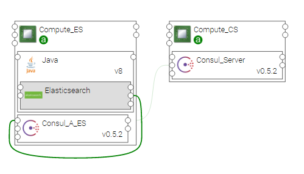
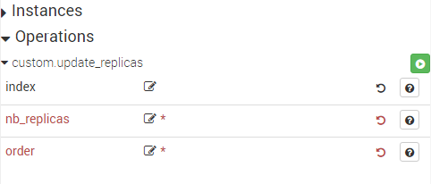
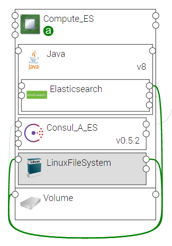

.. _elasticsearch_section:

*************
Elasticsearch
*************

.. contents::
    :local:
    :depth: 3

Elasticsearch is a search server based on **Apache Lucene**. It provides a distributed, multitenant-capable full-text search engine with a RESTful Web interface and schema-free JSON documents.

In the Elastic Stack architecture, Elasticsearch is the database that stores the logs sent by Logstash, and provides to Kibana the needed data for visualization.
Moreover, Elasticsearch Curator can be used to curate, or manage the Elasticsearch indices.

Elasticsearch concepts:

Index
     An index is like a 'database' in a relational database. It has a mapping which defines multiple types.
     An index is a logical namespace which maps to one or more primary shards and can have zero or more replica shards.

Shard
     A shard is a piece of data that stores your indexes. Each index has at least one shard but it can be split into more shards to allow horizontal scalability.

Replica
     A replica is a synchronized copy of another shard. It is used to improve resilience and performance of an Elasticsearch cluster.

Elasticsearch integrates the idea of cluster and nodes. A cluster is defined by a simple name. It is actually a group of nodes that work together. A node is an instance of Elasticsearch.
The cluster nodes share the shards and the replicas, and any of them can be queried indifferently.
The cluster nodes elect a master node that manages the operation. If the master node fails for any reason, another master is elected.

Elasticsearch
-------------

The following figure shows a Compute node hosting Elasticsearch.

Properties
^^^^^^^^^^

- **component_version:** Version of the component.

- **repository** : Download repository for this component artifacts. Providing a different value allows to specify an alternative repository.
  It is your responsibility to provide an accessible download url and to store required artifacts on it. You should specify only the base
  repository url. Artifacts names will be appended to it, so this property could be shared among several components using the inputs
  feature.

  - Default : https://www.elastic.co/downloads/elasticsearch

- **curator_repository_url**: Specifies an alternative YUM repository URL to install the curator.

  - Default : "http://packages.elastic.co/curator/4/centos/7"

- **curator_repository_key_url**: Specifies the GPG key to the YUM repository URL to install the curator.

  - Default : "https://packages.elastic.co/GPG-KEY-elasticsearch"

- **heap_size**: Sets the heap memory that will be allocated to Elasticsearch java process. It will allocate the same value to both min and max values.

- **cluster_name**: Specifies the name of the cluster to which the Elasticsearch instance will belong after the deployment operation.

  - Default: ystia

- **number_of_shards**: Defines the number of shards per index.

  - Default: 5. This means that the indexes may be split between 5 nodes if needed (if not enough space on one node for example).

- **number_of_replicas**:  Defines the number of replicas per index.

  - Default: 1 per index. This means that each shard of indexes will be duplicated on another node.

The following properties can be used to configure the **Curator** tool, which allows for Data Management in Elasticsearch.
See :ref:`data_management` for more details.

- **nb_close_older_than** and **unit_close_older_than**: to close old indexes.

- **nb_delete_older_than** and **unit_delete_older_than**: to delete old indexes.

.. note:: For safety reasons, Elasticsearch cannot be run as a *root* user.

Requirements
^^^^^^^^^^^^

- **host**: Elasticsearch should be hosted on a Java component. Java 7 or greater is required.
- **consul**: Elasticsearch component requires to be connected to a local Consul Agent. This is required to perform cluster
  discovery.
- **filesystem_endpoint**: Elasticsearch may be connected to a filesystem in order to store data on it. A typical use case would be
  to link this filesystem to a block storage in order to achieve data resilience and recovery.

Capabilities
^^^^^^^^^^^^

- **search_resource**: Search Endpoint used by components that need to connect to Elasticsearch (for example Logstash or Kibana)

Artifacts
^^^^^^^^^

- **scripts**: Elasticsearch required scripts.

- **config_file**: Elasticsearch configuration file

- **curator_cron_tab**: Crontab for curator execution

- **curator_action_file**: Contains actions to be executed by the curator

- **curator_config_file**: File that contains the curator configuration

- **consul_scripts**: Scripts required by the Consul component.

- **utils_scripts**: Common util scripts for whole Ystia components.

Cluster Management
^^^^^^^^^^^^^^^^^^

All the Elasticsearch instances relate to a Consul server via Consul agents, and can be grouped into a cluster of Elasticsearch nodes.
A cluster of Elasticsearch nodes shares the shards and replicas to provide High Availability (HA) and better quality of services.
It can be accessed by any node and provides the same response on each node.

If an Elasticsearch component has the same **cluster_name** property and is related to the same Consul server,
it will join the same cluster.

Dynamic reconfiguration
^^^^^^^^^^^^^^^^^^^^^^^
After deployment of an application containing an Elasticsearch component, you may change dynamically the number of replicas
for the created indices, as follows:

#. Go to the Application *Runtime* view
#. Select the *Elasticsearch* node
#. In the *Details* tab, open the *Operations* list
#. Use the **custom.update_replicas** operation to change the number of replicas via the **nb_replicas** parameter,

  - for a given index: use the **index** parameter to specify the index name,
  - or for all indexes: the *index* parameter is not specified
  - **order**: is the processing order of the replicas value, with lower order being applied first, and higher orders overriding them.
    (For details see https://www.elastic.co/guide/en/elasticsearch/reference/5.1/indices-templates.html#multiple-templates)

5. Click the *Execute* button

The following figure shows the dynamic reconfiguration of number of replicas:

BlockStorage Support
^^^^^^^^^^^^^^^^^^^^

Once the topology is deployed, a VM is created containing an Elasticsearch instance.
To be sure that data contained in Elasticsearch will not be lost even if the VM crashes, it is recommended to attach a BlockStorage component to the compute.

The Elasticsearch component has to be connected to a LinuxFileSystem component.
To create this relationship, bind the Elasticsearch component’s **filesystem_endpoint** prerequisite, to the LinuxFileSystem component’s feature capability, as shown in the following figure.

Elasticsearch Resilience
^^^^^^^^^^^^^^^^^^^^^^^^

Elasticsearch offers resilience to failures thanks to its distributed nature.
When deploying an Elasticsearch component, a node hosted in a VM is created and added to its corresponding cluster (see the **cluster_name** configuration property).

The scalability mechanism can be used to pre-configure the number of nodes (and VMs) to be created at deployment.
The configuration of the nodes number should be combined with the configuration of the **number_of_replicas** property.
For example, if two nodes and one replica are configured, the cluster may be fully functional as the replica can be allocated to one of the nodes.

Moreover, HA can be enforced by using a BlockStorage, as described above.

Three cases of failure are considered:

- Elasticsearch process shutdown
- VM shutdown
- VM network failure

The behavior described below is observed with the basic configuration of Elasticsearch, namely five shards and one replica.

In cluster mode (composed at least of two Elasticsearch instances), Elasticsearch is resilient (no loss of data).
However, there may be an interruption of service corresponding to the time when Elasticsearch rearranges shards and replicas based on the number of remaining instances.

In single instance mode (a cluster with one node), HA cannot be ensured in case the VM fails. All data are lost except if a BlockStorage is used.

Data Management
^^^^^^^^^^^^^^^

If the Elasticsearch component is connected to a Logstash component, you probably want to keep the logs for a certain time.
When it is no longer relevant, you can remove them from the visualization (close the indexes) or even completely erase them.

These features are provided by the following Elasticsearch properties:

- **nb_close_older_than** and **unit_close_older_than** to close old indexes.
- **nb_delete_older_than** and **unit_delete_older_than** to delete old indexes.

For example, to close the indexes older than two months and delete those older than one year, set the parameters as follows:

- nb_close_older_than:   2

- unit_close_older_than:   months

- nb_delete_older_than:   1

- unit_delete_older_than:   years

.. note:: If you leave the parameters unset, data will stand forever.

The close and delete operations are performed by the **Curator** tool in a cron job. By default, the job is started at 02:00 every day.
To override all the parameters, you can change the Cron table file by providing it as an artifact named **curator_cron_tab**.
You can also provide the artifact **curator_action_file** and the **curator_config_file** that will be used to configure the curator.
Below is an example of this file for Centos Linux distribution::

  0 2 * * *    LC_ALL=en_US.utf8 /usr/bin/curator --config /home/curator/curator.yml /home/curator/curator-action

.. note::    The PATH must be absolute and the % must be escaped with a \\ character.

For details on Curator, refer to https://www.elastic.co/guide/en/elasticsearch/client/curator/current/index.html
