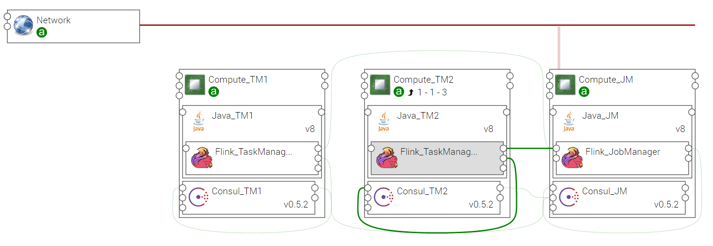

.. _flink_section:

*****
Flink
*****

.. contents::
    :local:
    :depth: 3

The Apache Flink software (https://flink.apache.org), an open source platform for distributed stream and batch data processing.

Flink implements a streaming dataflow engine that provides data distribution, communication, and fault tolerance for distributed computations over data streams.

Flink includes several APIs for creating applications that use the Flink engine:

- **DataStream API** for unbounded streams embedded in Java and Scala
- **DataSet API** for static data embedded in Java, Scala, and Python
- **Table API** with a SQL-like expression language embedded in Java and Scala.

Flink also bundles libraries for domain-specific use cases:

- **CEP**, a complex event processing library
- **Machine Learning** library
- **Gelly**, a graph processing API and library.

For more details on Flink concepts, see https://ci.apache.org/projects/flink/flink-docs-release-1.1/concepts/concepts.html

Flink Components
----------------

**Flink_JobManager** and **Flink_TaskManager** are the YSTIA components providing the the Apache Flink software for stream processing application developers.

The following figure shows a Flink application with one JobManager and two TaskManagers linked to it.
One of the TaskManager is hosted on a scalable compute so the number of instances of TaskManager can be increased or decreased at runtime.

Flink JobManager
----------------

**Flink_JobManager** is the master process, which coordinates the distributed execution.
The Job Managers schedule tasks, coordinate checkpoints, coordinate recovery on failures, etc.

At least one Job Manager is required.

Properties
^^^^^^^^^^

- **jobmanager.heap.mb**: JVM heap size (in megabytes) for the JobManager.

  - Default: 512

- **jobmanager.rpc.port**: Port used by JobManager to communicate with TaskManager (not editable).

- **repository**: Alternative download repository for the Apache Flink binary.

- **component_version**: Version of the component (not editable).

  - Default: 1.1.3

Requirements
^^^^^^^^^^^^

- **java**: A Flink_JobManager node must be hosted on a Java node, which is hosted itself on a compute node. The minimum version of Java is **JRE6**.

- **consul**: A Flink_JobManager node must be related to a Consul agent hosted on its Compute node.

Capabilities
^^^^^^^^^^^^

- **jobmanager**: Capabilities offered to TaskManager(s) to connect to this JobManager.

Artifacts
^^^^^^^^^

- **scripts**:  Flink required scripts.

- **consul_scripts**: Scripts required by the Consul component.

- **utils_scripts**: Common util scripts for whole Ystia components.

Flink TaskManager
-----------------

**Flink_TaskManager** is the worker process, which executes the tasks (or more specifically, the subtasks) of a dataflow, and buffers and exchanges the data streams.

At least one Task Manager is required.

Properties
^^^^^^^^^^

- **taskmanager.heap.mb**: JVM heap size (in megabytes) for the TaskManager.

  - Default: 512

- **taskmanager.numberOfTaskSlots**: Number of parallel operator or user function instances that a single TaskManager can run. This value is typically proportional to the number of physical CPU cores that the TaskManager’s machine has (for example, equal to the number of cores, or half the number of cores).

  - Default: 1

- **parallelism.default**: Default parallelism to use for programs that have no parallelism specified. For setups that have no concurrent jobs running, setting this value to NumTaskManagers * NumSlotsPerTaskManager will cause the system to use all available execution resources for the program execution.

  - Default: 1

- **taskmanager.tmp.dirs**: List of directories into which Flink writes temporary files when data do not fit into main memory. The directory paths must be separated by ‘:’ (colon character).

  - Default: /tmp

- **repository**: Alternative download repository for the Apache Flink binary.

- **component_version**: Version of the component (not editable).

  - Default: 1.1.3

Requirements
^^^^^^^^^^^^

- **jobmanager_endpoint**: A Flink_TaskManager must be connected to a Flink_JobManager.

- **java**: A Flink_TaskManager node must be hosted on a Java node, which is hosted itself on a compute node. The minimum version of Java is **JRE6**.

- **consul**: A Flink_TaskManager node must be related to a Consul agent hosted on its Compute node.

Artifacts
^^^^^^^^^

- **scripts**:  Flink required scripts.

- **consul_scripts**: Scripts required by the Consul component.

- **utils_scripts**: Common util scripts for whole Ystia components.
