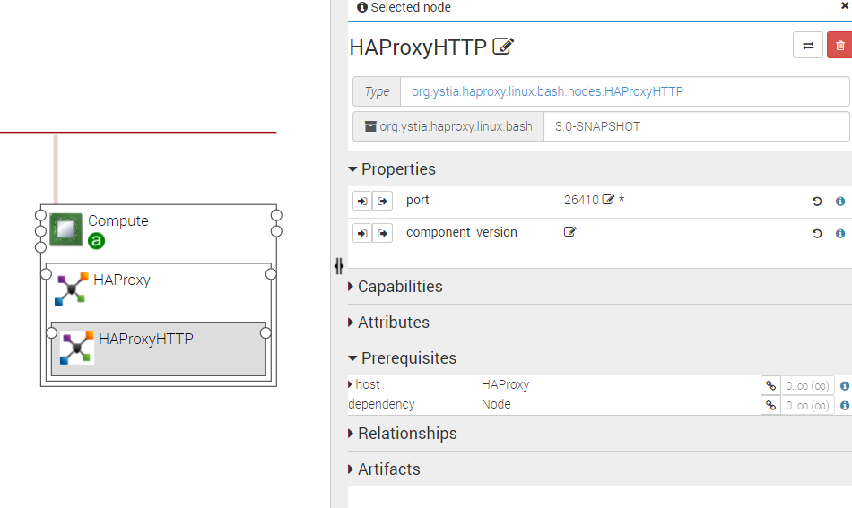

.. _haproxy_section:

*********************
HA Proxies components
*********************

.. contents::
    :local:
    :depth: 3

HAProxy is a fast and reliable solution offering high availability, load balancing, and proxying for TCP and HTTP-based applications.

There are 3 types of HAProxy components, all being packed in the same YSTIA CSAR

- HAProxy is only necessary to host HAProxyHTTP or HAProxyTCP
- HAProxyHTTP provides proxying for HTTP
- HAProxyTCP provides proxying for TCP

The following figure shows a HAProxyHTTP node:

HAProxy
-------

Requirements
^^^^^^^^^^^^

- **host**: HAProxy requires to be hosted on a Compute.

Capabilities
^^^^^^^^^^^^

- **host**: HAProxy can host HAProxyHTTP or HAProxyTCP components.

Artifacts
^^^^^^^^^

- **scripts**:  HAProxy required scripts.

- **utils_scripts**: Common util scripts for whole Ystia components.

HAProxyHTTP
-----------

Properties
^^^^^^^^^^

- **port**: Port number for HTTP mode

Requirements
^^^^^^^^^^^^

- **host**: HAProxyHTTP requires to be hosted on a HAProxy.

Artifacts
^^^^^^^^^

- **scripts**:  HAProxy required scripts.

- **utils_scripts**: Common util scripts for whole Ystia components.

HAProxyTCP
----------

Properties
^^^^^^^^^^

- **port**: Port number for TCP mode

Capabilities
^^^^^^^^^^^^

- **app_endpoint**: Application Endpoint

Requirements
^^^^^^^^^^^^

- **host**: HAProxyTCP requires to be hosted on a HAProxy.

Artifacts
^^^^^^^^^

- **scripts**:  HAProxy required scripts.

- **utils_scripts**: Common util scripts for whole Ystia components.

