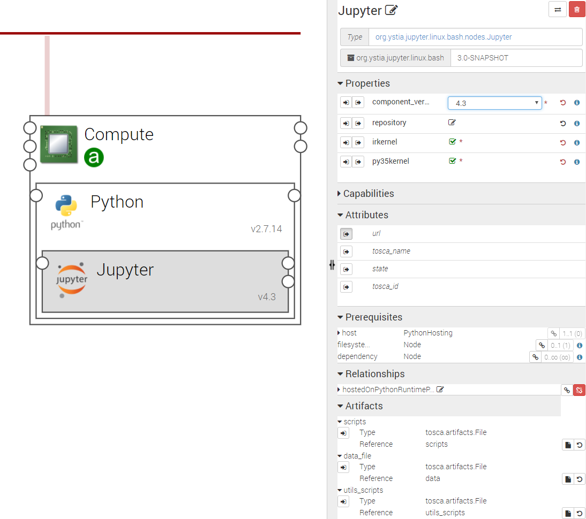

.. _jupyter_section:

*******
Jupyter
*******

.. contents::
    :local:
    :depth: 3

The **Jupyter** component installs Jupyter_ **Notebook**, a Web application that allows you to create and share documents
that contain live code, equations, visualizations and explanatory text.
Uses include data cleaning and transformation, numerical simulation, statistical modeling, machine learning and much more.

A Jupyter node is hosted on a Python node.

.. _Jupyter: http://jupyter.org/

The following figure shows a Jupyter node configuration

Properties
^^^^^^^^^^

- **component_version**: Version of the component.

- **irkernel**: If checked, installs the iRKernel, a Jupyter kernel for the R language.

- **py35kernel**: If checked, installs the Jupyter kernel for Python v3.5.

Attributes
^^^^^^^^^^

- **url**: The URL to access to Notebook UI.

Requirements
^^^^^^^^^^^^

- **host**: Jupyter requires to be hosted on python component.

- **filesystem_endpoint**: Jupyter may be connected to a filesystem in order to store its runtime data on it.

Artifacts
^^^^^^^^^

- **scripts**: Jupyter required scripts.

- **utils_scripts**: Common util scripts for whole Ystia components.

- **data_file**: Jupyter additional scripts.

