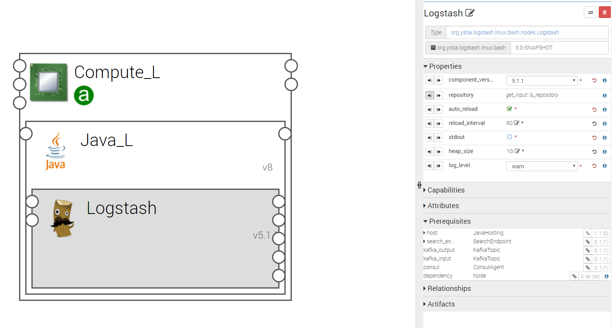
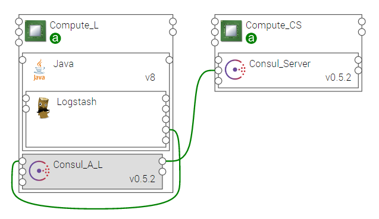

.. _logstash_section:

********
Logstash
********

.. contents::
    :local:
    :depth: 3

Logstash is a tool for receiving, processing and outputting logs. All kinds of logs are concerned: system logs, webserver logs, error logs, application logs, etc.
Logstash provides a powerful pipeline for storing, querying, and analyzing logs. It includes an arsenal of built-in inputs, filters, codecs, and outputs, that are integrated as plugins.
See https://www.elastic.co/guide/en/logstash/5.1/index.html for details about all these plugins' configuration

Logstash Component
------------------
A Logstash node should be hosted on a Java node, which is hosted itself on a compute node as shown in the following figure.
The minimum version of Java is **JRE 8**.

Properties
^^^^^^^^^^

- **component_version:** Version of the component.

- **repository** : Download repository for this component artifacts. Providing a different value allows to specify an alternative repository.
  It is your responsibility to provide an accessible download url and to store required artifacts on it. You should specify only the base
  repository url. Artifacts names will be appended to it, so this property could be shared among several components using the inputs
  feature.

  - Default : https://www.elastic.co/downloads/logstash

- **auto_reload:**  If set to true, Logstash monitors configuration changes and reloads configuration whenever it is changed.

  - Default: false

- **reload_interval:**  If auto-reload is true, this property specifies how frequently to poll the configuration location for changes, in seconds.

- **stdout**:  If set to true, the simple stdout output is added to the output configuration of Logstash.

  - Default: false

- **heap_size**: Sets the heap memory that will be allocated to Logstash java process. It will allocate the same value to both min and max values.

  - Default: 1G

- **log_level:**  Defines Logstash log level. All logs are redirected to a file except if stdout is set to true.

  - Default: warn (very few logs are generated by Logstash).

Requirements
^^^^^^^^^^^^

- **host**: Logstash should be hosted on a Java component. Java 8 or greater is required.
- **consul**: Logstash component requires to be connected to a local Consul Agent. This is required to perform cluster
  discovery.
- **search_endpoint**: allows to connect a Logstash component to Elasticsearch
- **kafka_output**: allows to connect Logstash as the output of a Kafka broker
- **kafka_input**: allows to connect Logstash as the input of a Kafka broker

Capabilities
^^^^^^^^^^^^

- **logstash_resource**: Endpoint used by components that need to connect to Logstash
- **connector_host**: Logstash can host connectors, like for example a Twitter connector

Artifacts
^^^^^^^^^

Input, output and filter configurations can be provided by these dedicated artifacts:

- **input_conf**
- **output_conf**
- **filter_conf**

Artifacts for security configuration:

- **certificates**: Directory containing certificates
- **private_key**: SSL key for logstash forwarder configuration
- **certificate**: SSL certificate for logstash forwarder configuration

Other artifacts:

- **scripts**: Logstash required scripts.
- **config**: Logstash configuration files' directory
- **consul_scripts**: Scripts required by the Consul component.
- **utils_scripts**: Common util scripts for whole Ystia components.

Advanced Functionalities
------------------------

Logstash Relationships
^^^^^^^^^^^^^^^^^^^^^^

Logstash can be used in a simple Elastic Stack toolchain as shown in the following figure.

In a more complex toolchain, a **broker** can be used to split the Logstash pipe in two parts: a **shipper** and an **indexer** as shown in the following figure.

When using Logstash in an Elastic Stack toolchain, it must be related to a Consul agent hosted on its Compute node as shown in the following figure. This is required for the discovery of the Elasticserach cluster.

Dynamic Reconfiguration
^^^^^^^^^^^^^^^^^^^^^^^

You can change the Logstash configuration at runtime without having to redeploy the application.

Three custom commands are available to change the configuration:

- for input configuration files
- for output configuration files
- for filter configuration files

These commands need an argument: the URL of the file to be replaced. No matter how the file name is, it will be renamed to overwrite the previous file.

In the runtime view, select the Logstash component and choose the appropriate custom command.

When the command is started, a green popup appears. Wait a minute for Logstash to be restarted, because the command will stop the process, then restart it.

You can follow the process in the **events** tab.

****

**Limitations**
  If you have a cluster of Logstash, the reconfiguration is valid for all the Logstash instances of the cluster. However, in the case of scale up operation, the modifications will not be taken in account.

****

Logstash Elasticity
^^^^^^^^^^^^^^^^^^^^

The component **Logstash Indexer** is scalable. The scalability of this component allows Log Analysis applications to deal with a huge amount of logs incoming from the Kafka broker. It is possible to deploy initially a topology with one or more Logstash Indexer and it is possible to scale out (add) or scale in (remove) Logstash Indexer instances at runtime.

Each Logstash Indexer instance is a consumer of the same Kafka topic but of a different partition of this topic. If there are more partitions of the Kafka topic than Logstash Indexer (consumer), some consumers will read several partitions. But if there are more consumers than partitions, some consumers will not be used. So, it is important to correlate these two values (the number of partitions of the Kafka topic and the number of maximum instances of Logstash Indexer).

Logstash Resilience
^^^^^^^^^^^^^^^^^^^

Three cases of failures are considered:

- Logstash process shutdown
- VM shutdown
- VM network failure

In cluster mode (composed at least of two Logstash instances), Logstash is always resilient (no service interruption and no loss of data). The Cloudify manager should re-create a new VM and reconnect it to the Elastic Stack chain or just restart the service depending on the problem encountered. This process is automatic and takes between 1 and 5 minutes.

On the other side, in a single instance mode, we cannot ensure the resilience since if the VM crashes, the service is lost for a short amount of time and all data sent during this interval of time are lost. However, this problem can be prevented by using a Kafka broker.

Data Management
^^^^^^^^^^^^^^^

If the Elasticsearch component is connected to a Logstash component, you probably want to keep the logs for a certain time.
When it is no longer relevant, you can remove them from the visualization (close the indexes) or even completely erase them.

These features are provided by the following Elasticsearch properties:

- **nb_close_older_than** and **unit_close_older_than** to close old indexes.
- **nb_delete_older_than** and **unit_delete_older_than** to delete old indexes.

For example, to close the indexes older than two months and delete those older than one year, set the parameters as follows:

- nb_close_older_than:   2

- unit_close_older_than:   months

- nb_delete_older_than:   1

- unit_delete_older_than:   years

.. note:: If you leave the parameters unset, data will stand forever.

The close and delete operations are performed by the **Curator** tool in a cron job. By default, the job is started at 02:00 every day.
To override all the parameters, you can change the Cron table file by providing it as an artifact named **curator_cron_tab**.
You can also provide the artifact **curator_action_file** and the **curator_config_file** that will be used to configure the curator.
Below is an example of this file for Centos Linux distribution::

  0 2 * * *    LC_ALL=en_US.utf8 /usr/bin/curator --config /home/curator/curator.yml /home/curator/curator-action

.. note::    The PATH must be absolute and the % must be escaped with a \\ character.

For details on Curator, refer to https://www.elastic.co/guide/en/elasticsearch/client/curator/current/index.html
