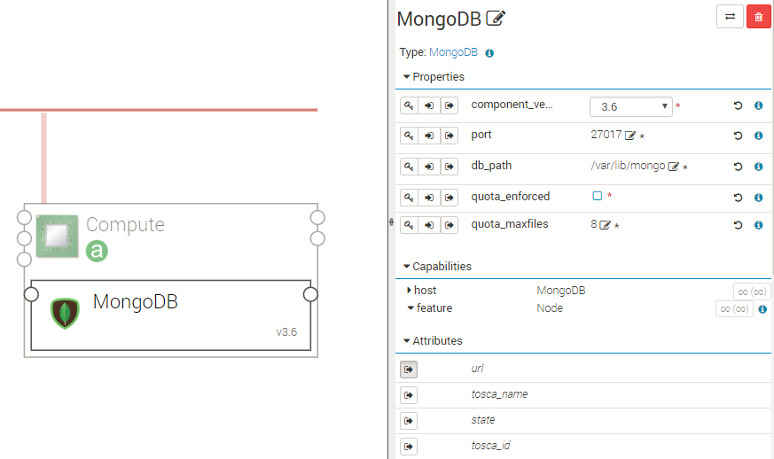

.. _mongodb_section:

*******
MongoDB
*******

.. contents::
    :local:
    :depth: 3

MongoDB is a NOSQL database oriented document.
https://www.mongodb.com/

MongoDB Component
-----------------

A MongoDB node is hosted on a Compute node.

The following figure shows a MongoDB node configuration:

Properties
^^^^^^^^^^

- **component_version**: Version of MongoDB to install. Versions 3.2, 3.4, 3.6 available.
  - Default: 3.6
- **port**: TCP port MongoDB.
  - Default: 2707
- **db_path**: Path the DB is stored on.
  - Default: /var/lib/mongo
- **quota_enforced**:  Limits each database to a certain number of files.
  - Default: false
- **quota_maxfiles**:  Number of quota files per DB.
  - Default: 8

Requirements
^^^^^^^^^^^^

- **host**: MongoDB component requires to be hosted on a Compute
