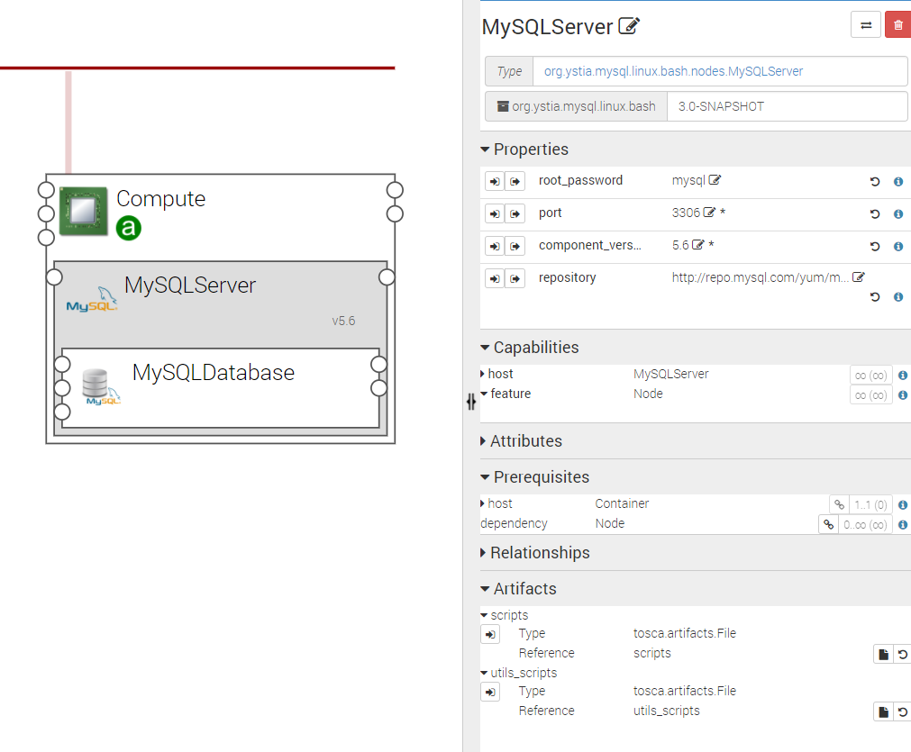
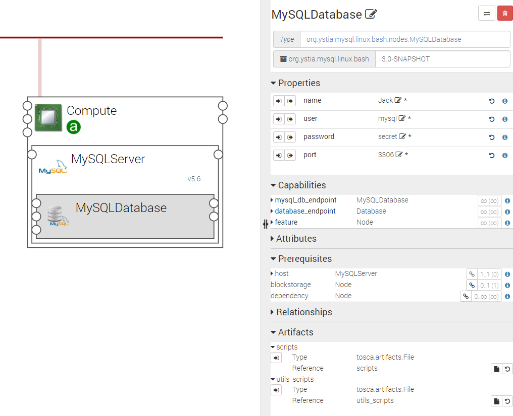

.. _mysql_section:

*****
MySQL
*****

.. contents::
    :local:
    :depth: 3

**MySQL** is a relational database management system (RDBMS) and MySQL Ystia components correspond to *MySQL Community Edition*.
(See https://www.mysql.com/products/community/ or https://dev.mysql.com/)

MySQLServer Component
---------------------

The following figure shows a MySQLServer node configuration:

Properties
^^^^^^^^^^

- **component_version:** Version of the component

- **repository**: Repository URL of the MySQL RPM

  - Default value: http://repo.mysql.com/yum/mysql-5.6-community/el/7/x86_64
- **root_password**: Password for the *root* user of the DataBase Management System

  - Default value: *mysql*
- **port**: Port of MySQLServer

  - Value: *3306*

Requirements
^^^^^^^^^^^^

- **host**:  MySQLServer component requires to be hosted on a Compute.

Capabilities
^^^^^^^^^^^^

- **host**: MySQLServer component may host a MySQLDatabase component.

Artifacts
^^^^^^^^^

- **scripts**: MySQLServer required scripts.

- **utils_scripts**: Common util scripts for whole Ystia components.

MySQLDatabase Component
-----------------------

The following figure shows a MySQLDatabase node configuration:

Properties
^^^^^^^^^^

- **name**: Database name.

  - Default value: *DB1*
- **user**: User to connect to database.

  - Default value: *db1*
- **password**: Usee password.

  - Default value: *secret*
- **port**: Database port.

  - Value: *3306*

****

**Warning**:
  User name must be unique between the different databases hosted on the same MySQLServer.

****

Requirements
^^^^^^^^^^^^

- **host**:  MySQLDatabase component requires to be hosted on a MySQLServer component.

- **blockstorage**: MySQLDatabase may be connected to a BlockStorage in order to store data on it to achieve data resilience and recovery.

Capabilities
^^^^^^^^^^^^

- **mysql_db_endpoint**: Endpoint used by components that need to connect to this MySQLDatabase.

- **database_endpoint**: Deprecated.

Artifacts
^^^^^^^^^

- **scripts**: MySQLDatabase required scripts.

- **utils_scripts**: Common util scripts for whole Ystia components.

