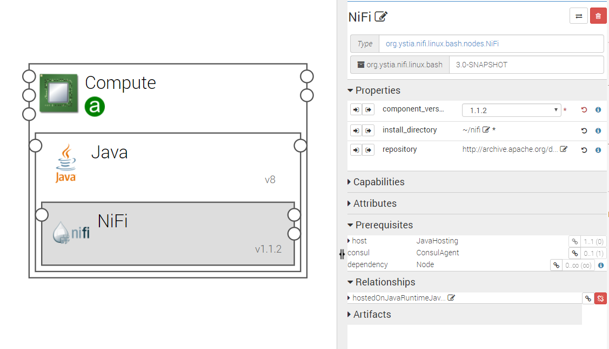

.. _nifi_section:

****
Nifi
****

.. contents::
    :local:
    :depth: 3

**Nifi** is a technical component provided by Ystia allowing data acquisition, simple event processing, transport and delivery mechanism designed to accommodate the diverse dataflows generated by connected systems (Databases, Sensors, Data Lakes, Data Platforms).

**Nifi** is used for data ingestion to pull data into NiFi, from numerous different data sources and create FlowFiles using a process group.
A Process Group is a specific set of processes and their connections, which can receive data via input ports and send data out via output ports. In this manner, process groups allow creation of entirely new components simply by composition of other components.

See https://nifi.apache.org/ for details.

The following figure shows Nifi node configuration.

Properties
^^^^^^^^^^

- **component_version**: Version of the component.

- **repository**: Download repository for this component artifacts. Providing a different value allows to specify an alternative repository.

- **installation_directory**: Allows you to choose where to install **Nifi** binaries

  - Default: ~/nifi

Requirements
^^^^^^^^^^^^

- **host**: Nifi node must be hosted on a Java node, which is hosted itself on a compute node. The minimum version of Java is **JRE8**.

Artifacts
^^^^^^^^^

- **scripts**:  Nifi required scripts.

- **consul_scripts**: Scripts required by the Consul component.

- **utils_scripts**: Common util scripts for whole Ystia components.

Attributes
^^^^^^^^^^

- **url**: The URL to access nifi GUI.
