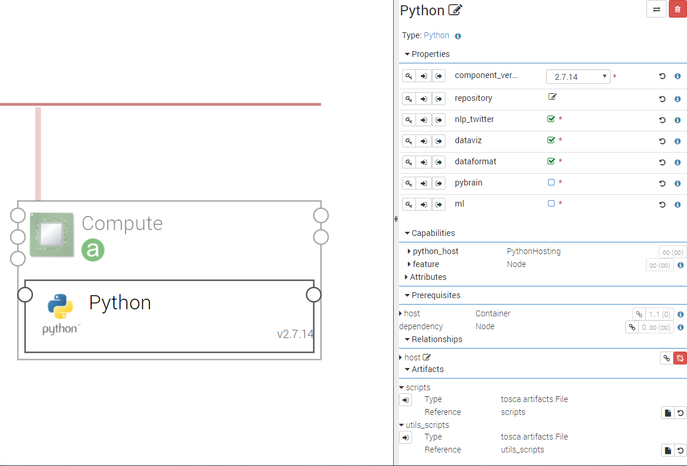

.. _python_section:

******
Python
******

.. contents::
    :local:
    :depth: 3

The **Python** component installs Anaconda and optionally some Python libraries.
Anaconda_ is a package manager, environment manager and Python distribution.

.. _Anaconda: https://docs.anaconda.com/

A Python node is hosted on a Compute node. The components that need Python are hosted on the Python node.

Properties
^^^^^^^^^^

- **component_version**: Version of the Python component.

- **repository**: This property give the opportunity to specify an alternative download repository for Anaconda and the additionnal packages.
  It is your responsibility to provide an accessible download url and to store required artifacts on it.
  The repository must contain the Anaconda install script (.sh) and optionnal additonnal packaged as tar.bz2
  (oauthlib, requests-oauthlib, nltk, twython, seaborn, plotly, csvkit, configparser, pybrain).

- **nlp_twitter**: If checked, installs additional packages for Natural Language Processing and twitter API (nltk, twython).

- **dataviz**: If checked, installs additional packages for data visualization (seaborn, plotly).

- **dataformat**: If checked, installs additional packages for data formatting (csvkit, configparser).

- **pybrain**: If checked, installs Python-based reinforcement learning, artificial intelligence and neural network library (pybrain).

Capabilities
^^^^^^^^^^^^

- **python_host**: Allows other components (as Jupyter for example) to be host on Python.

Requirements
^^^^^^^^^^^^

- **host**: Python component has to be hosted on a Compute.

Artifacts
^^^^^^^^^

- **scripts**: Python required scripts.

- **utils_scripts**: Common util scripts for whole Ystia components.

