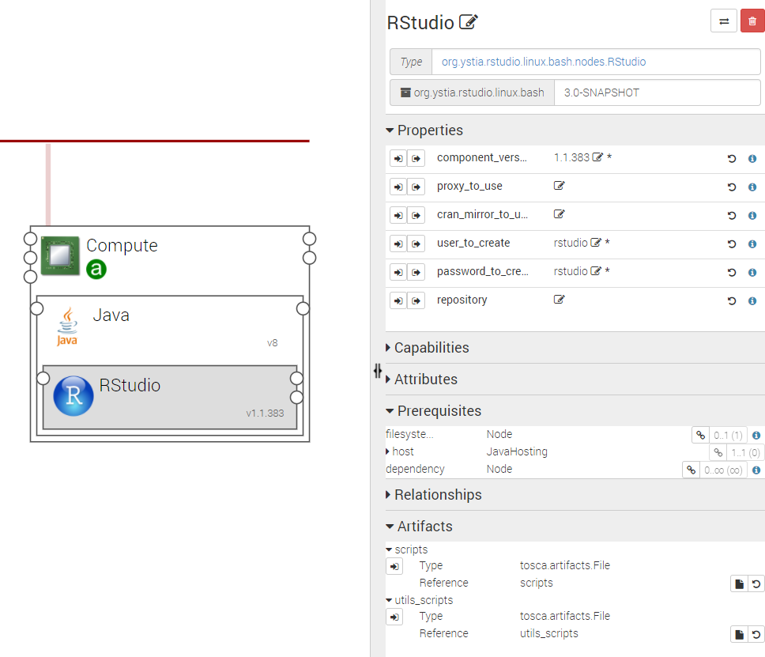
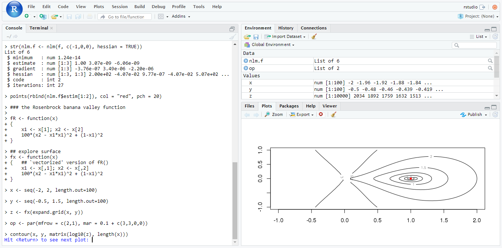

.. _rstudio_section:

*******
RStudio
*******

.. contents::
    :local:
    :depth: 3

RStudio_ Server is a Web based integrated development environment (IDE) for R.
It includes a console, syntax-highlighting editor that supports direct code execution, as well as tools for plotting,
history, debugging and workspace management.

RStudio component
^^^^^^^^^^^^^^^^^

A **RStudio** node is hosted on a Java node.

.. _RStudio: https://www.rstudio.com/

The following figure shows a RStudio node configuration

Properties
""""""""""

- **component_version**: Version of the component.

- **proxy_to_use**: Setup a proxy configuration in Renviron.site to allow downloading remote packages.
  If a value is set for this property, it will be used as http and https proxy (it should honor the unix http_proxy env var format).
  If not set or set to an empty string, the default environment proxy settings on the compute will be used (http_proxy, https_proxy and no_proxy).
  If set to ‘None’ then proxies are not configured at all.

  - Default: “”
- **cran_mirror_to_use**: Mirror for R packages downloads to use. This allows you to setup and use your own mirror.

  - Default: http://cran.r-project.org
- **user_to_create**: Name of the unix account to be created and used to connect to RStudio.

  - Default: rstudio
- **password_to_create**: Password of the unix account to be created and used to connect to RStudio.

  - Default: rstudio
- **repository**: Alternative download repository for this component artifacts.
  It is your responsibility to provide an accessible download url and to store required artifacts on it.
  You should specify only the base repository url. Artifacts names will be appended to it.

  - Default: “”

Attributes
""""""""""

- **url**: The URL used to access the RStudio UI.
  This attribute is only valid if the Compute on which RStudio is hosted is connected to a public network.

Requirements
""""""""""""

- **host**: RStudio requires to be hosted on Java component.

- **filesystem_endpoint**: RStudio may be connected to a filesystem in order to store its runtime data on it.

Artifacts
"""""""""

- **scripts**: RStudio required scripts.

- **utils_scripts**: Common util scripts for whole Ystia components.

Installed packages
^^^^^^^^^^^^^^^^^^

The following common packages for data science are also provided:

+------------+--------------+-------------+-------------+--------------+----------+
| ade4       | arules       | biglm       | boot        | C50          | car      |
+------------+--------------+-------------+-------------+--------------+----------+
| caret      | combinat     | corrplot    | dplyr       | doSNOW       | e1071    |
+------------+--------------+-------------+-------------+--------------+----------+
| FactoMineR | ff           | ffbase      | foreach     | foreign      | gbm      |
+------------+--------------+-------------+-------------+--------------+----------+
| gplots     | ggplot2      | glmnet      | gmodels     | grplasso     | ipred    |
+------------+--------------+-------------+-------------+--------------+----------+
| kernlab    | lattice      | leaps       | LiblineaR   | lubridate    | MASS     |
+------------+--------------+-------------+-------------+--------------+----------+
| mice       | missForest   | nnet        | penalized   | plyr         | pROC     |
+------------+--------------+-------------+-------------+--------------+----------+
| questionr  | randomForest | randtoolbox | network     | RColorBrewer | ROCR     |
+------------+--------------+-------------+-------------+--------------+----------+
| rpart      | rpart.plot   | Rserve      | sas7bdat    | shiny        | snow     |
+------------+--------------+-------------+-------------+--------------+----------+
| speedglm   | stringr      | tidyr       | tree        | ggvis        |          |
+------------+--------------+-------------+-------------+--------------+----------+
| tm         | RCurl        | elastic     | plotly      | arulesViz    | plsRglma |
+------------+--------------+-------------+-------------+--------------+----------+
| RKlout     | twitteR      |             |             |              |          |
+------------+--------------+-------------+-------------+--------------+----------+

Using RStudio
^^^^^^^^^^^^^

RStudio is an online IDE for R.

The following figure shows the IDE User Interface.

You can use the user and password provided as TOSCA properties to log on the RStudio Server UI.
In addition, any user account on the hosting server having an active password would be able to log on to RStudio.
All users can store projects and workspaces into their home directory.
If the RStudio component is connected to a LinuxFileSystem component, the home directory of the default user is created
under this LinuxFileSystem.

How to install new R packages
^^^^^^^^^^^^^^^^^^^^^^^^^^^^^

****

**Notes**:
  Some R packages need to be compiled at installation time. So sometimes when compiling an R package,
  a required system library may be missing, leading to an installation failure.
  In this case, you should manually install the required library on the system hosting RStudio
  and then retry the package installation.

****

How to install per-user new R packages
""""""""""""""""""""""""""""""""""""""

If you know the exact name of the package to install, enter from the online R Console:

::

  install.packages(c("package1-name", "package2-name", ...))
  library("package1-name")
  ...

You can also use the Packages tab in the UI and click Install.
A package selection with auto-completion text box will allow you to select the packages you want to install.

****

**Notes**:
  Per-user packages are installed in the user’s home directory.

****

How to install per-user new R packages
""""""""""""""""""""""""""""""""""""""

To install system-wide R packages, you need a root access to the system hosting RStudio. Then enter:

::

  R --no-save -e 'install.packages(c("package1-name", "package2-name", ...))'

