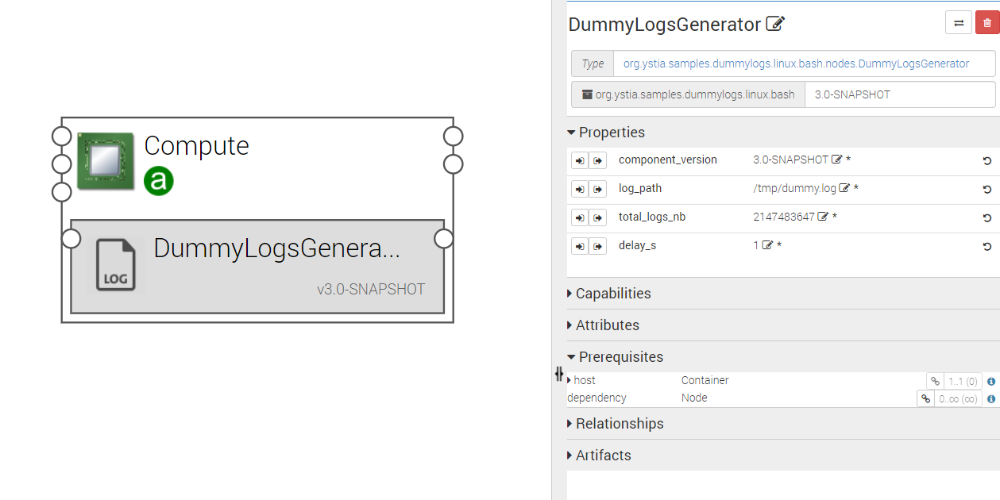

**************************
Dummylog sample components
**************************

.. contents::
    :local:
    :depth: 3

This component can be used to test an ELK chain with some generated log data.

DummyLogsGenerator
------------------

Generated periodically log data to a log file. It can be configured using the properties below:

Properties
^^^^^^^^^^

- **component_version**: Version of the component.

- **log_path**: Log file path

- **total_logs_nb**: The number of generated log messages

- **delay_s**: generation frequency

Requirements
^^^^^^^^^^^^

- **host**: DummyLogsGenerator component has to be hosted on a Compute.

Artifacts
^^^^^^^^^

- **scripts**: DummyLogsGenerator required scripts.

- **utils_scripts**: Common util scripts for whole Ystia components.

DummyLogsDashboard
------------------
This is a Kibana dashboard allowing to visualize the generated logs.
It must be hosted on a Kibana node.

