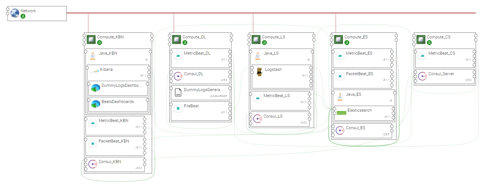

.. _elk_beats:

*********
ELK_BEATS
*********

This topology template allows for creating an example of Elastic Stack application that uses various Beats components.

.. contents::
    :local:
    :depth: 3

Install Components and Topology template
----------------------------------------
Install the CSARs of the following YSTIA compoents to the Alien4Cloud Components catalog, and respect the order in the list:

#. **common**
#. **consul**
#. **java**
#. **kafka**
#. **elasticsearch**
#. **logstash**
#. **kibana**
#. **beats**
#. **dummylogs**

Install the **elk_beats** topology archive to the Alien4Cloud Topology template catalog

Topology template
-----------------
The **elk_beats** template provides the following configuration:

- Relationships between the ELK components are created.

- ELK components are designed to be deployed on Compute hosts and appropriate Java distribution.

- Consul allows Elasticsearch cluster discovery. I contains information about the application's services.

- A compute hosting the DummyLogsGenerator component and a FileBeat component, both pre-configured to share the logs file. A relationship is created to connect FileBeat with Logstash.

- A MetricBeat component is installed on each node hosting ELK components and on the node hosting the Consul server. It is connected to Elasticsearch.

- A PacketBeat component is installed on the Kibana and Elasticsearch nodes, and the relationship is created to connect them with Elasticsearch.

- The kibana node is hosting the DummyLogsDashboard but also a specific Dashboard allowing to show monitoring data shipped by the Beats components.

Create en application
---------------------
The application can be created via the Alien4Cloud GUI using the **elk_beats** topology shown below:

Complete configuration
----------------------

- You will need to upload a **Logstash** configuration file using **filter_conf** artifact. Use the logstash-dummylogs-filters.conf file, located the config repository of the Dummylogs YSTIA component.

- Deploy application and when the application is running, connect to the Kibana GUI using the component's **url** output attribute

- You may open the DummyLogs_V5 dashboard, the MetricBean and PacketBean dashboard. Because of a known issue with the MetricDashboard, it is necessary to reload some indexes : in the Management view, click to *Index Patterns*, select packetbeat-* index and refresh the field list using the dedicated icon.