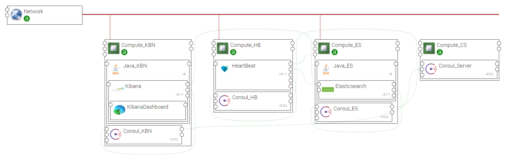

.. _elk_heartbeat:

*************
ELK_HEARTBEAT
*************

This topology template allows for creating an example of Elastic Stack application that uses the HeartBeat component to monitor application services.

.. contents::
    :local:
    :depth: 3

Import Components and Topology template
----------------------------------------

  This step may be skipped in case you use Alien4Cloud's git integration for CSARs management

Upload the following Ystia components' CSARs to the Alien4Cloud catalog, and respect the order in the list:

#. **common**
#. **consul**
#. **java**
#. **kafka**
#. **elasticsearch**
#. **kibana**
#. **beats**

Upload the **elk_heartbeat** topology archive to the Alien4Cloud Topology template catalog.

Topology template
-----------------
The **elk_heartbeat** template provides the following configuration:

- Relationships between the Elastic Stack components are created.

- Elastic Stack components are designed to be deployed on Compute hosts and appropriate Java distribution.

- Consul allows Elasticsearch cluster discovery. I contains information about the application's services.

- A HeartBeat component is installed on a dedicated compute nodes, and the relationship is created with Elasticsearch in order to ship into it the monitoring data. Moreover HeartBeat is connected to Compute node in order to obtain service availability information

Create en application
---------------------
The application can be created via the Alien4Cloud GUI using the **elk_heartbeat** topology shown below:

Complete configuration
----------------------

- Deploy application and when the application is running, connect to the Kibana GUI using the component's **url** output attribute

- In the *Management* view, click to *Index Patterns* and create the index heartbeat-*

- In the *Discover* view select the index heartbeat-*, add the *monitor* and *up* fields

- You may now check the elasticsearch service is up (tcp-plain@<elasticsearch-IP>:8300 and tcp-plain@<elasticsearch-IP>:9300)