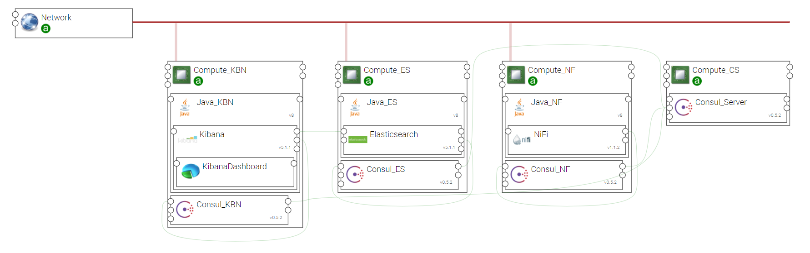
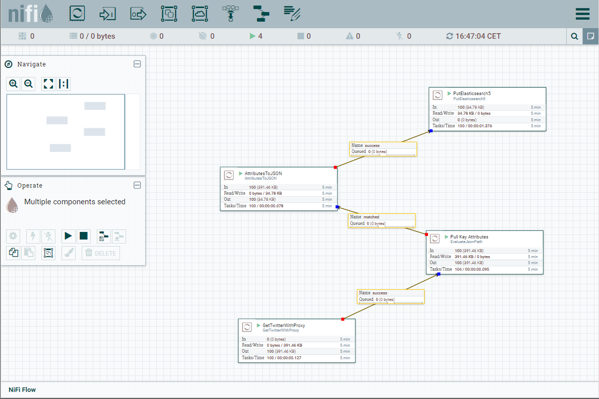

.. _elk_nifi_section:

********
ELK_NIFI
********

.. contents::
    :local:
    :depth: 3

Import Components and Topology template
----------------------------------------

  This step may be skipped in case you use Alien4Cloud's git integration for CSARs management

Upload the following YSTIA components' CSARs to the Alien4Cloud catalog, and respect the order in the list:

#. **common**
#. **consul**
#. **java**
#. **kafka**
#. **elasticsearch**
#. **logstash**

Upload the **elk_nifi** topology archive to the Alien4Cloud Topology template catalog.

Topology template
-----------------
The **elk_nifi** template allows to create a data flow processing application using Nifi. This application uses data input from Twitter and outputs data into Elasticsearch. Kibana can be used to
display this data.
The template provides the following configuration:

- Relationships between Elasticsearch, Kibana and Nifi nodes are created

- The components are designed to be deployed on Compute hosts and appropriate Java distribution.

- Thi Nifi component is configured

- Consul allows Elasticsearch cluster discovery.

Create en application
---------------------
The application can be created via the Alien4Cloud GUI using the **elk_nifi** topology shown below:

Complete configuration
----------------------

- Deploy the application created at the previous step.

- Connect to the Nifi User Interface to import a template. Use the **url** output attribute of the Nifi component to get the address of the GUI. Use the nifi-es5-demo-template.xml file, located the dataflows repository of this topology.
  You can see https://nifi.apache.org/docs/nifi-docs/html/user-guide.html#templates for details about Nifi templates.

- Configure the Twitter component - the GetTwitterWithProxy processor :

   #. Add your twitter credentials (consumer key & secret , access token key & secret)
   #. Set twitter endpoint to Sample EndPoint
   #. Set proxy host and proxy port

- Configure the Elasticsearch component - PutElasticsearch5 processor :

   #. cluster name: nifi
   #. hosts: <ES-IP>:9300
   #. index: bigdata
   #. type: tweets

Run the Nifi DataFlow
---------------------

#. Select all processors ie hold down the shift-key and drag your mouse across the entire data flow
#. Go to the actions toolbar in the left window labeled Operate and click the start button

Then the NiFi UI looks like:

Finally, connect to Kibana using the **url** output attribute of the component, and create an index pattern names **bigdata**. Check the collected tweets using the Discover view.
