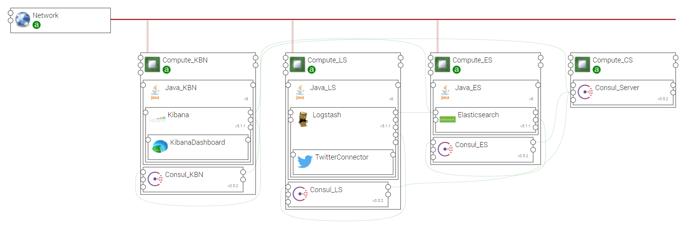

.. _elk_twitter_section:

***********
ELK_TWITTER
***********

.. contents::
    :local:
    :depth: 3

Import Components and Topology template
----------------------------------------

  This step may be skipped in case you use Alien4Cloud's git integration for CSARs management

Upload the following Ystia components' CSARs to the Alien4Cloud catalog, and respect the order in the list:

#. **common**
#. **consul**
#. **java**
#. **kafka**
#. **elasticsearch**
#. **logstash**

Upload the **elk_twitter** topology archive to the Alien4Cloud Topology template catalog.

Topology template
-----------------
The **elk_twitter** template provides the following configuration:

- Relationships between the ELK components are created.

- ELK components are designed to be deployed on Compute hosts and appropriate Java distribution.

- Consul allows Elasticsearch cluster discovery.

- The twitter connector is hosted by the Logstash node

Create an application
---------------------
A Log Analysis application can be created via the Alien4Cloud GUI using the **elk_twitter** topology shown below:

Complete configuration
----------------------

- Create a **Kibana Dashboard** to present the specific data items corresponding to the application needs.
  You can find in the dashboards repository of this topology the Kibana dashboard twitter sample : "kdb_fr_cities.json"

- Configure the Twitter connector by setting values for properties *consumer_key*, *consumer_secret*, *oauth_token*, *oauth_token_secret*,
  *use_proxy*, *proxy_address*, *proxy_port* (sse README file in the Logstash component's source code).

