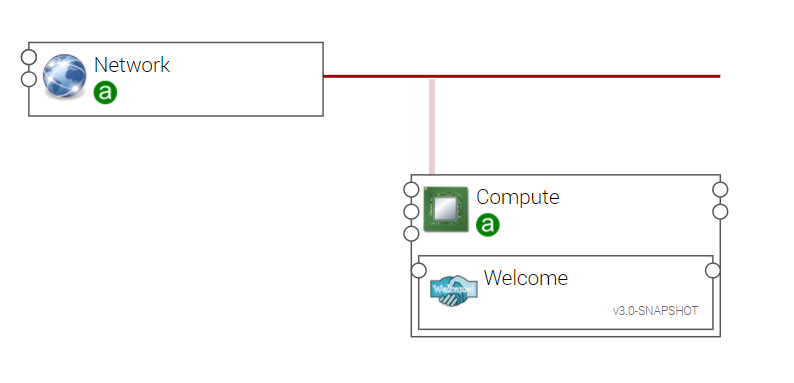
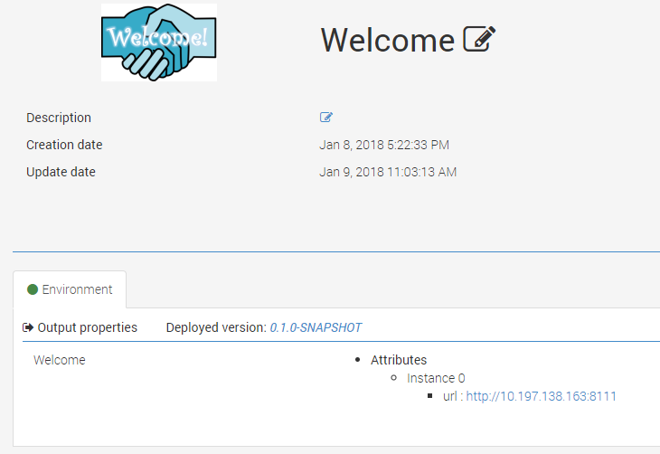

**************
Welcome sample
**************

.. contents::
    :local:
    :depth: 3

welcome_basic topology
----------------------

The **welcome_basic** Ystia topology is useful to easily create an Alien4Cloud application with the **Welcome** component.
It can be used to create and deploy your first Alien4Cloud application and to check the Ystia installation.

welcome_basic CSAR
------------------

You have to generate a zip archive file for this topology and upload it to the Alien4Cloud Catalog.
::

  $ cd YOUR_SANDBOX/csar-public-library/org/ystia/samples/topologies/welcome
  $ zip -r welcome_basic-csar.zip *

After the csar upload, you may check in the Alien4Cloud Topology templates vue that the ``org.ystia.samples.welcome_basic`` template is present.

Install Components
------------------

Install the CSARs of the following YSTIA compoents to the Alien4Cloud Components catalog, and respect the order in the list:

#. ``org.ystia.common``
#. `org.ystia.samples.welcome.linux.bash``

Create application
------------------

The sample application can now easily created using the ``org.ystia.samples.welcome_basic`` topology template.

Deploy the application
----------------------

The created application can now be deployed to the location of your choice.

The deployment should success if the orchestrator and the location are correctly configured (see the Alien4Cloud documentation and the orchestrator's documentation) and if the target infrastructure is available.

Now you can connect to the Welcome application using the **url** output property.

Outputs
^^^^^^^

- **url**: The URL to access the Welcome HTTP server home page

This output property can be used to easily connect to the Welcome HTTP server home page.

