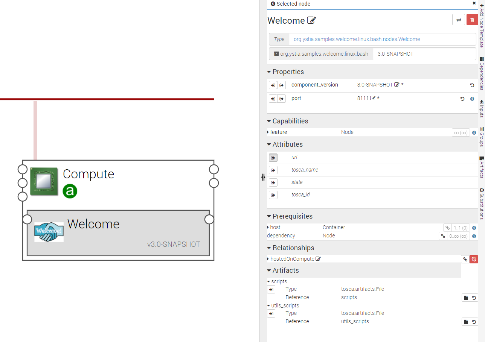
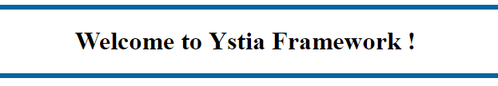

**************
Welcome sample
**************

.. contents::
	:local:
	:depth: 3

Welcome component
-----------------

The **Welcome** Ystia component is a very sample HTTP server.
It can be used to create and deploy your first Alien4Cloud application and to check the Ystia installation.

The following figure shows a *Compute* node hosting *Welcome*

:scale: 80
   :align: center

The *Welcome* HTTP server index page looks like:

:scale: 100
   :align: center

Properties
^^^^^^^^^^

- **component_version**: Version of the component.

- **port**: Port number of the Welcome HTTP server.

Attributes
^^^^^^^^^^

- **url**: The URL to access the Welcome page.

