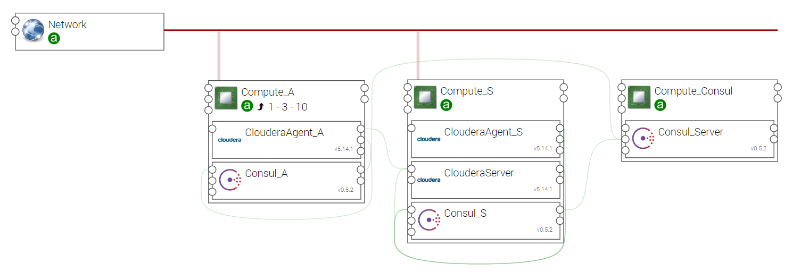

.. _cloudera_basic_section:

**************
CLOUDERA-BASIC
**************

.. contents::
    :local:
    :depth: 3

Import Components and Topology template
----------------------------------------

  This step may be skipped in case you use Alien4Cloud's git integration for CSARs management

Upload the following Ystia components' CSARs to the Alien4Cloud catalog, and respect the order in the list:

#. **common**
#. **consul**
#. **cloudera**

Upload the **cloudera_basic** topology archive to the Alien4Cloud Topology template catalog.

Topology template
-----------------

Ystia provides a basic topology for Cloudera, which deploys:

- on one node, the Cloudera Manager Server and an embedded PostgreSQL database

- on all the nodes, the Cloudera Manager Agent.

Then, the administrator can deploy a CDH Cluster from the Cloudera Manager Admin Console.

This topology enables the administrator to size flexibly a CDH cluster, and to install the Cloudera Manager
for provisionning, managing and monitoring the cluster.
Its use is mandatory to be able to manage all services.

Three compute node types host the interconnected components:

- **Compute_Consul** node: The Consul Server that runs on a single compute node and is aware of all the compute nodes in the cluster.

- **Compute_S** node: This node contains the Cloudera Manager Server (with an embedded database), a Cloudera Agent,
  and a Consul Agent component.
  The Administrator of the Hadoop Cluster must be able to connect directly to this node
  and to interact with the Cloudera Manager Server Admin Console with a browser.

- **Compute_A** node: A node that can be scaled to obtain the remainder of the Hadoop Cluster.
  Each node contains a Cloudera Agent and a Consul Agent.

The deployment requires a CentOS 7 Linux system.

The minimum size for each node type is as follows:

+----------------+--------------+-----------+
| **Node Type**  | **RAM Size** | **vCPUs** |
+----------------+--------------+-----------+
| Compute_Consul | 4 GB         | 2         |
+----------------+--------------+-----------+
| Compute_S      | 8 GB         | 4         |
+----------------+--------------+-----------+
| Compute_A      | 8-16 GB      | 4-8       |
+----------------+--------------+-----------+

How to deploy a Cloudera Hadoop cluster
---------------------------------------

To deploy a CDH cluster, you need to:

#. create, configure and deploy an application using the **cloudera-basic** topology, and
#. then configure and deploy a CDH Cluster with the services you choose, using the Cloudera Manager Admin Console.

- Create an application using the **cloudera-basic** topology.

- You may change the number of **Compute_A** nodes. The default value is 3.
  This will enable you to create a CDH cluster of 4 nodes (1 *Compute_S* node and 3 *Compute_A* nodes).

- You may change the input properties to replace the public repositories with local repositories, and the NTP server used.

- Once the application is deployed by Alien4Cloud, a cluster of nodes is available with Cloudera Manager ready to deploy CDH Cluster.
  Then connect to the Cloudera Manager Admin Console dashboard on the Compute_S node using the output property
  *url* attribute of *ClouderaServer*::

  http://<Compute_S_IP>:7180/
    user: admin
    password: admin

- And finally, configure and deploy a CDH Cluster with the services you choose using the Cloudera Manager Admin Console.

****

**Note**:
  Cloudera Manager provides two methods for installing CDH and its associated components:
  traditional packages (RPMs or Debian packages) or parcels.
  Cloudera in Ystia uses traditional packages method.

****

