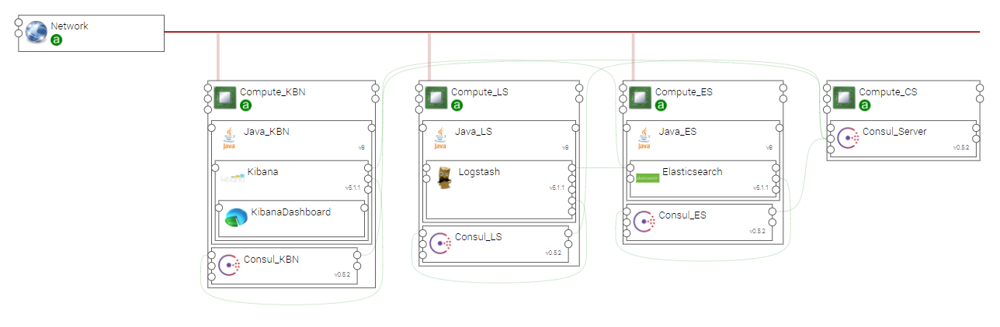

.. _elk_basic_section:

*********
ELK_BASIC
*********

.. contents::
    :local:
    :depth: 3

Install Components and Topology template
----------------------------------------
Install the CSARs of the following YSTIA compoents to the Alien4Cloud Components catalog, and respect the order in the list:

#. **common**
#. **consul**
#. **java**
#. **kafka**
#. **elasticsearch**
#. **logstash**
#. **kibana**

Install the **elk_basic** topology archive to the Alien4Cloud Topology template catalog.

Topology template
-----------------
The **elk_basic** template provides the following configuration:

- Relationships between the ELK components are created.

- ELK components are designed to be deployed on Compute hosts and appropriate Java distribution.

- Consul allows Elasticsearch cluster discovery.

The resilience of the Log Analysis applications created with the ELK-basic template is based on the resilience of the **Elasticsearch** component.

Create en application
---------------------
A Log Analysis application can be created via the Alien4Cloud GUI using the **elk_basic** topology shown below:

Complete configuration
----------------------

- You will probably need to upload **Logstash** configuration files (at least **input_conf** and **filter_conf** artifacts).

- Create a **Kibana Dashboard** to present the specific data items corresponding to the application needs.

- **Elasticsearch cluster** may need to be configured, as described in the **Elasticsearch** component's documentation.
