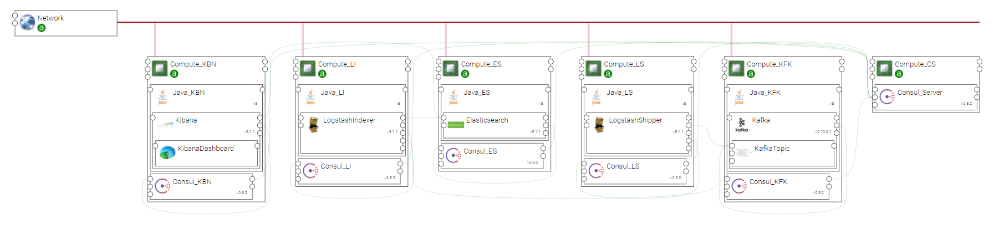

.. _elk_broker_section:

**********
ELK_BROKER
**********

.. contents::
    :local:
    :depth: 3

Import Components and Topology template
----------------------------------------

  This step may be skipped in case you use Alien4Cloud's git integration for CSARs management

Upload the following Ystia components' CSARs to the Alien4Cloud catalog, and respect the order in the list:

#. **common**
#. **consul**
#. **java**
#. **kafka**
#. **elasticsearch**
#. **logstash**
#. **kibana**

Upload the **elk_broker** topology archive to the Alien4Cloud catalog.

Topology template
-----------------
The **elk_broker** topology template enriches the **elk_basic** one with a **Kafka** broker component.
Moreover, the **Logstash** component is replaced by two Logstash instances, **LogstashShipper** and **LogstashIndexer**, which act as log producer and log consumer respectively.
This allows for separating the processing part of the Elastic Stack architecture, delegated to LogstashIndexer, from the ingestion part delegated to LogstashShipper.
The two instances are connected to a same retention queue provided by Kafka.

**LogstashShipper** is configured as the Logstash instance in the **elk_basic** template, except that its relationship with the Elasticsearch instance is replaced by a relationship with the **Kafka Topic** instance.

**LogstashIndexer** is configured as the Logstash instance in the **elk_basic** template, except that it has an additional relationship allowing consuming logs from **Kafka Topic**.

****

**Note**
  The kafka version compatible with Logstsh version is the version 0.10.

****

Create an application
---------------------
A Log Analysis application can be created via the Alien4Cloud GUI using the **elk_broker** topology shown below:

Complete configuration
----------------------

- You will probably need to upload **Logstash** nodes' configuration files (at least **input_conf** and **filter_conf** artifacts).

- Create a **Kibana Dashboard** to present the specific data items corresponding to the application needs.

- **Elasticsearch cluster** may need to be configured, as described in the **Elasticsearch** component's documentation.
