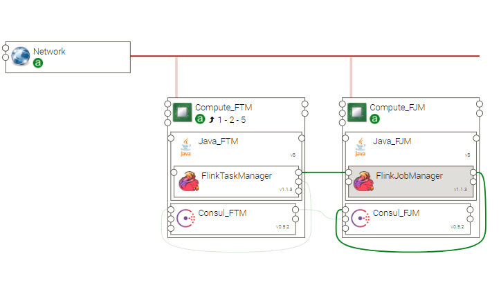

.. _flink_top_section:

***********************
Flink Topology Template
***********************

.. contents::
    :local:
    :depth: 3

This topology uses Flink Ystia components to install and start a ready to use Flink Cluster.

Import Components and Topology template
----------------------------------------

  This step may be skipped in case you use Alien4Cloud's git integration for CSARs management

Upload the following Ystia components' CSARs to the Alien4Cloud catalog, and respect the order in the list:

#. **common**
#. **consul**
#. **java**
#. **flink**

Upload the **flink** topology archive to the Alien4Cloud Topology template catalog.

Topology template
-----------------
The **flink** template contains:

- A compute that hosts the Java component hosting the FlinkJobManager

- A scalable compute that hosts the Java component hosting the FlinkTaskmanager component

- FlinkTaskManager components are linked to FlinkJobManager

- Each compute hosts a Consul component ; the Consul server is hosted by the the compute hosting the FlinkJobManager.

- FlinkJobManager and FlinkTaskmanager components are linked to the local Consul node in order to register in the Consul cluster the corresponding services

Create and deploy a Flink cluster
-------------------------------
First create an application via the Alien4Cloud GUI using the **flink** topology shown below:

Once deployed, the cluster is running and you can connect to the Flink dashboard to create streaming applications, using the FlinkJobManager's **dashboard_url** ouput property.

