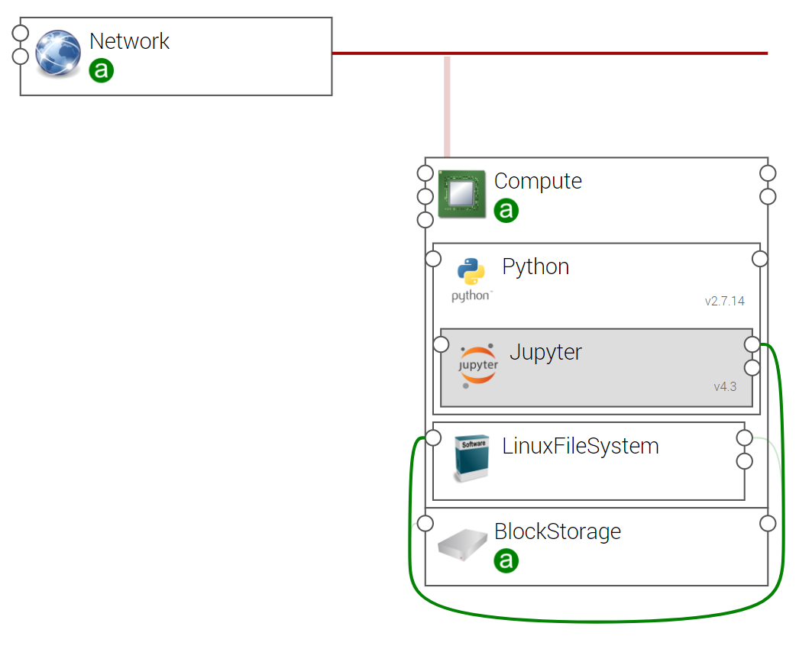
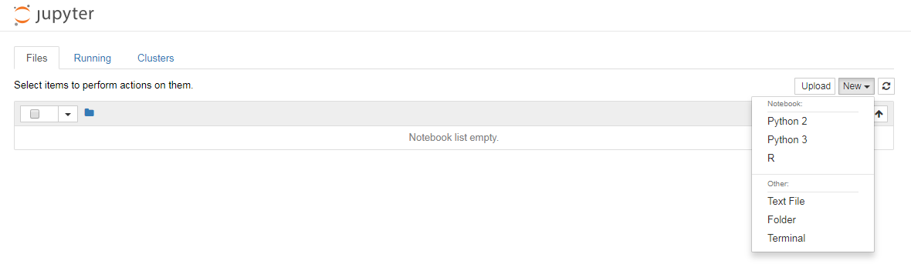

.. _jupyter_topo_section:

*************************
Jupyter Topology Template
*************************

.. contents::
    :local:
    :depth: 3

Import Components and Topology template
----------------------------------------

This step may be skipped in case you use Alien4Cloud's git integration for CSARs management

Upload the following Ystia components' CSARs to the Alien4Cloud catalog, and respect the order in the list:

#. **common**
#. **python**
#. **jupyter**

Upload the **jupyter** topology archive to the Alien4Cloud Topology template catalog.

Topology template
-----------------

The **jupyter** template contains:

- A compute that hosts the Python component.

- A BlockStorage attached to the compute.

- A LinuxFileSystem hosted on the compute and linked to the BlockStorage.

- A Jupyter hosted on Python and connected to the LinuxFileSystem.

Create and deploy an application
--------------------------------
Your application can be created via the Alien4Cloud GUI using the **jupyter** topology shown below:

Once deployed, used the output property **jupyter_url** to connect to Jupyter Notebook.

The following figure shows the initial Jupyter Notebook UI

