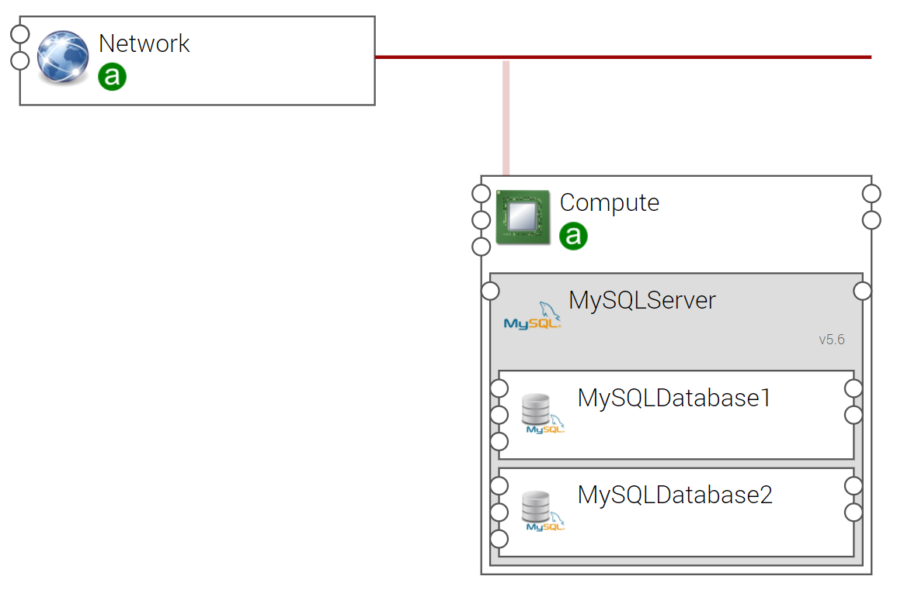

.. _mysql_single_topo_section:

******************************
MySQL Single Topology Template
******************************

.. contents::
    :local:
    :depth: 3

Import Components and Topology template
----------------------------------------

This step may be skipped in case you use Alien4Cloud's git integration for CSARs management

Upload the following Ystia components' CSARs to the Alien4Cloud catalog, and respect the order in the list:

#. **common**
#. **mysql**

Upload the **mysql_single** topology archive to the Alien4Cloud Topology template catalog.

Topology template
-----------------

The **mysql_single** template contains:

- A compute.

- A MySQLServer hosted on the compute.

- Two MySQLDatabase hosted on the MySQLServer.

Create and deploy an application
--------------------------------

Your application can be created via the Alien4Cloud GUI using the **mysql_single** topology shown below:

Once the application is deployed, the two MySQL database *DB1* and *DB2* are available.

