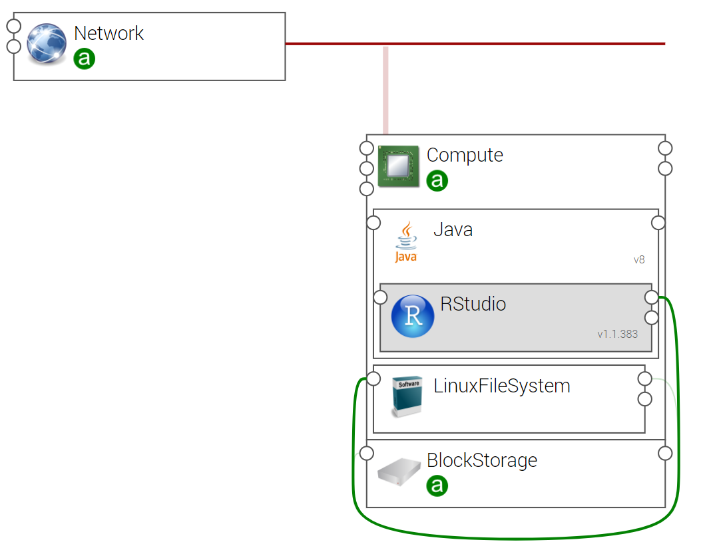

.. _rstudio_topo_section:

*************************
RStudio Topology Template
*************************

.. contents::
    :local:
    :depth: 3

Import Components and Topology template
----------------------------------------

This step may be skipped in case you use Alien4Cloud's git integration for CSARs management

Upload the following Ystia components' CSARs to the Alien4Cloud catalog, and respect the order in the list:

#. **common**
#. **java**
#. **rstudio**

Upload the **rstudio** topology archive to the Alien4Cloud Topology template catalog.

Topology template
-----------------

The **rstudio** template contains:

- A compute that hosts the Java component.

- A BlockStorage attached to the compute.

- A LinuxFileSystem hosted on the compute and linked to the BlockStorage.

- A RStudio hosted on Java and connected to the LinuxFileSystem.

Attach a BlockStorage component to the compute and connect RStudio to a LinuxFileSystem ensure data persistence even a VM failure,
and so RStudio user's data (projects and workspaces) will not be lost.

Create and deploy an application
--------------------------------

Your application can be created via the Alien4Cloud GUI using the **rstudio** topology shown below:

Once deployed, use the output property **rstudio_url** to connect to RStudio User Interface.

