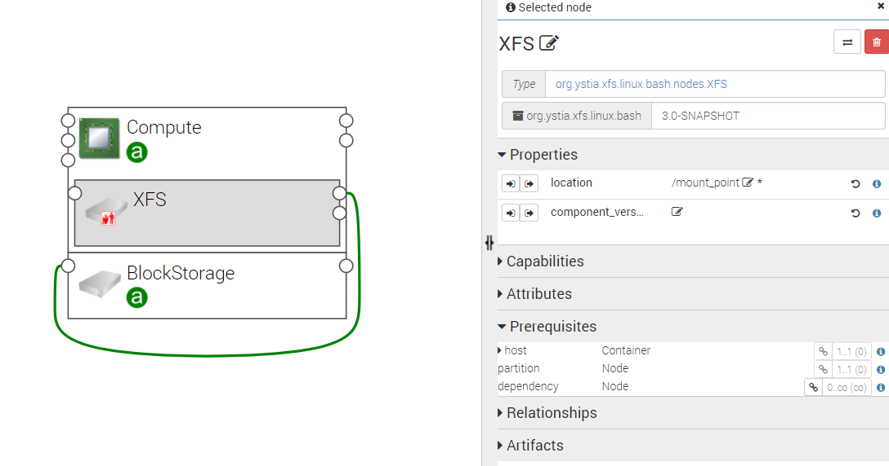

.. _xfs_section:

XFS (eXtended Dile System)
--------------------------

XFS is a highly scalable, high-performance 64-bit journaling file system originally designed at Silicon Graphics, Inc (SGI).

XFS supports metadata journaling, which facilitates quicker crash recovery.
The XFS file system can also be defragmented and enlarged while mounted and active.

The following figure shows a XFS node configuration.

Properties
^^^^^^^^^^

- **location**: The relative location (for example path on the file system), which provides the root location
  to address an attached node.
  Example: a mount point / path such as ‘/usr/data’.
  Note: The user must provide it and it cannot be “root”.

Requirements
^^^^^^^^^^^^

- **host**: XFS filesystem requires to be hosted on a Compute (with *linux* as *type*).

- **partition**: XFS filesystem should be linked to a block storage.
  If not already done (when reusing an existing block storage for instance) a partition is created on the device
  associated with this block storage and formatted in XFS.

****

**Note**
  This component is only supported on **Centos 7**.
  To use it on an **Ubuntu 14.04**, you should use an OS image with XFS pre-installed which is not the default.

****
