.. _getting_started_section:

***************
Getting Started
***************

This section describes how to set up a basic application cluster using BDCF components.

.. contents::
	:local:
	:depth: 2

.. _getting_started_requirements_section:

Requirements
============

BDCF requires:

- A running **OpenStack** cloud : OpenStack_
- A running instance of **Cloudify** 3.4
- A running instance of **Alien4Cloud** 1.3
- The **BDCF** package, which provides components and topology templates to upload in the Alien4Cloud catalog

.. _OpenStack: https://www.openstack.org/

OpenStack Requirements
----------------------

- Currently, BDCF only supports the **Liberty** version of OpenStack.
- **Neutron** must be installed as the OpenStack networking component.
- OpenStack tenants must be allowed to associate **Floating IPs** to VMs from a public network.
- The Centos default repository must be accessible from the VMs, to allow BDCF to install packages from this repository.
- OpenStack APIs (**Keystone**, **Nova**, **Horizon**, etc) must be accessible from OpenStack projects, via the interface the APIs run on. This information is available within OpenStack in **Admin > System Panel > System Info**.

Cloud Image Requirements
-------------------------

Currently, BDCF is based and validated on the **CentOS 7.2** distribution.

Centos 7.2 image requirements
^^^^^^^^^^^^^^^^^^^^^^^^^^^^^^

The Centos 7.2 cloud image used to deploy BDCF applications requires to configure default Centos yum repositories.
**Extra Packages for Enterprise Linux** (**EPEL**) repository (https://dl.fedoraproject.org/pub/epel/7/x86_64/) must also be configured, because some tools installed by BDCF come from this repository.

Instantiated VMs should be able to resolve their own hostname. This means that the hostname should be resolvable via either DNS or **/etc/hosts**.
The default Centos 7.2 Cloud Image uses **CloudInit** to set the name of the VM chosen in OpenStack as system hostname but, by default, CloudInit does not change **/etc/hosts**.
So, if you are using CloudInit, we recommend changing the default configuration to force CloudInit to write the hostname in **/etc/hosts** and to resolve it as *localhost*.
To do so, create a **.cfg** file in the **/etc/cloud/cloud.cfg.d** directory containing the following directive::

  manage_etc_hosts: localhost

Alien4Cloud and Cloudify Requirements
-------------------------------------

Install Alien4Cloud and Cloudify
^^^^^^^^^^^^^^^^^^^^^^^^^^^^^^^^

Install Alien4Cloud and Cloudify as described in the following documentation:

  - Alien4Cloud 1.2 : http://alien4cloud.github.io/#/documentation/1.2.0/index.html
  - Cloudify 3.3.1 : http://docs.getcloudify.org/3.3.1/intro/what-is-cloudify/

.. warning ::

  By default `max_worker` is set to 5, which is not enough to deploy the MapR components of BDCF. So, at the Cloudify manager bootstrap step, define `max_worker=25` in manager blueprint. 

Configure Alien4Cloud
^^^^^^^^^^^^^^^^^^^^^
Alien4Cloud must be configured to use Cloudify 3 as orchestrator. This is enabled by the **Cloudify 3 Orchestrator** plugin (check the **Plugins** view in the **Administration** menu).

Configure the **orchestrator** and the **location** corresponding to your OpenStack project. 

.. note:: **orchestrator** and **location** are Alien4Cloud concepts defined in Alien4CloudDocumentation_.

Some resources must be defined and configured for the location. These resources will be mapped to OpenStack physical resources at application deployment. 

To configure location resources:

- Define at least one Image for each OpenStack image corresponding to an OS distribution used by the applications (Ubuntu trusty, CentOS, etc.).
- Create some flavors for sizing the images.
- Optionally, create some On demand Resources such as:
   
   - **Volumes** or **DeletableVolumes** (set the **size** property).
   - **PublicNetwork**: set in the **floatingip** property block, the **floating_network_name** property corresponding to the name of the public network in OpenStack.

The following figure shows an example of resources defined within a location named **OpenStack** from an orchestrator named **Cfy3**:

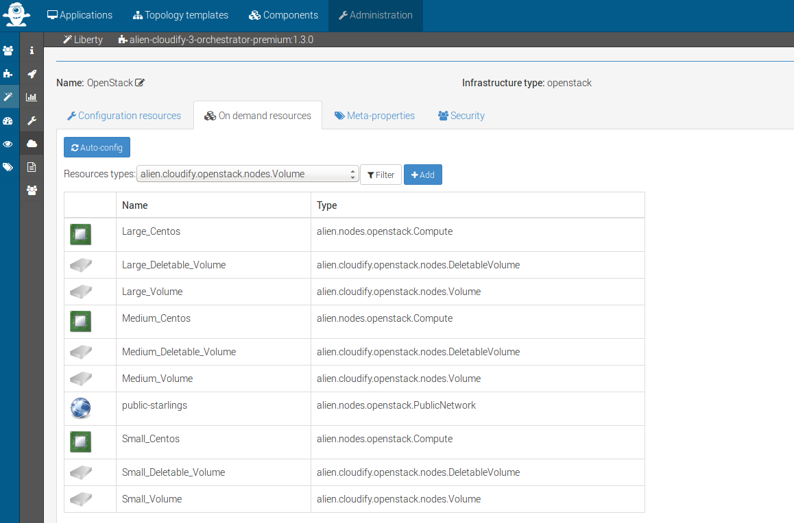

.. note:: See **Configure your orchestrator and location** in Alien4Cloud GettingStarted_ for more details.

.. _Alien4CloudDocumentation: http://alien4cloud.github.io/#/documentation/1.2.0/index.html
.. _GettingStarted: http://alien4cloud.github.io/#/documentation/1.2.0/getting_started/getting_started.html

Import BDCF Components
==========================

To import BDCF components, drag and drop ZIP files from the BDCF package to Alien4Cloud, in the respective **Components** and **Topology templates** tabs.

Import CSAR for a Welcome application in this order:

1. **welcome-x.y.z-csar.zip**
2. **welcome-basic-x.y.z-topo.zip**

The following figure shows the drag and drop screen.

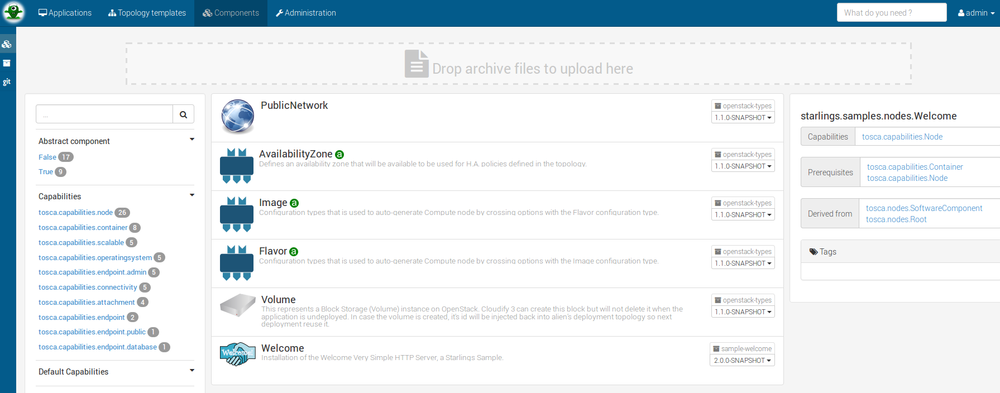

Deploying your first cluster
============================

Create the application
----------------------

To create a BDCF application:

1. Click the **Applications** menu to access the **Applications** interface.
2. Click the **New application** button.
3. Fill in the form with a name and select the **welcome-basic** topology template.
4. Click the **Create** button.

The application is now ready.

Deploy the application into the cloud
-------------------------------------

1. From the **Applications** interface, click the application previously created.
2. Click the **Deploy** menu on the left of the screen:

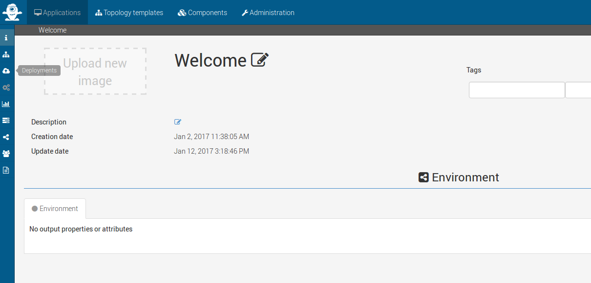

3. At the first deployment, select the location in the **Locations** tab.:

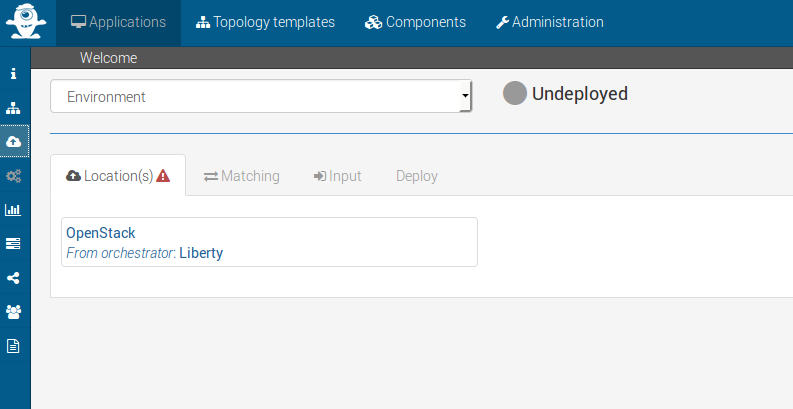

4. You can select physical resources in the **Substitution** tab. For example, in the image below, the **Medium_Centos** Compute is selected and its configuration can be customized if necessary.

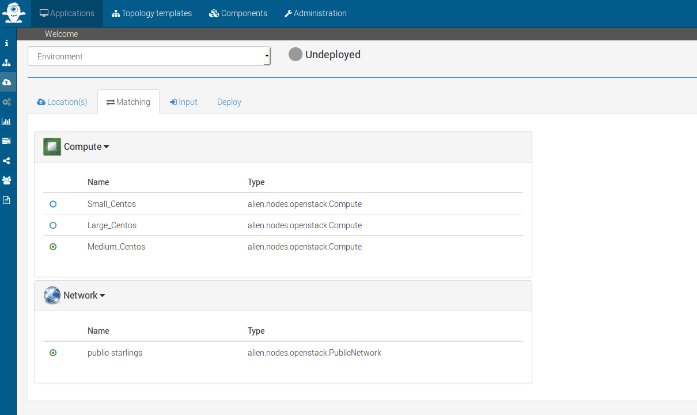

5. Deploy the application from the **Deploy** tab:

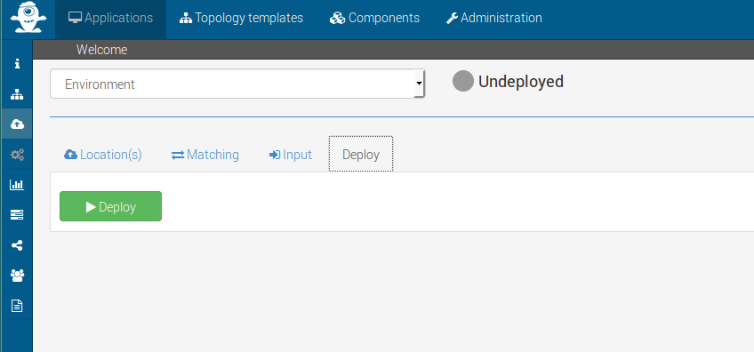

Monitor deployment
------------------

After about 30 seconds (depending on your infrastructure), a VM instance is created in the OpenStack cloud. It contains the **Welcome** component ready for use.

Click the **Runtime** icon (on the left vertical bar), to verify the operation. Events about deployment state are displayed, as illustrated in the following figure:

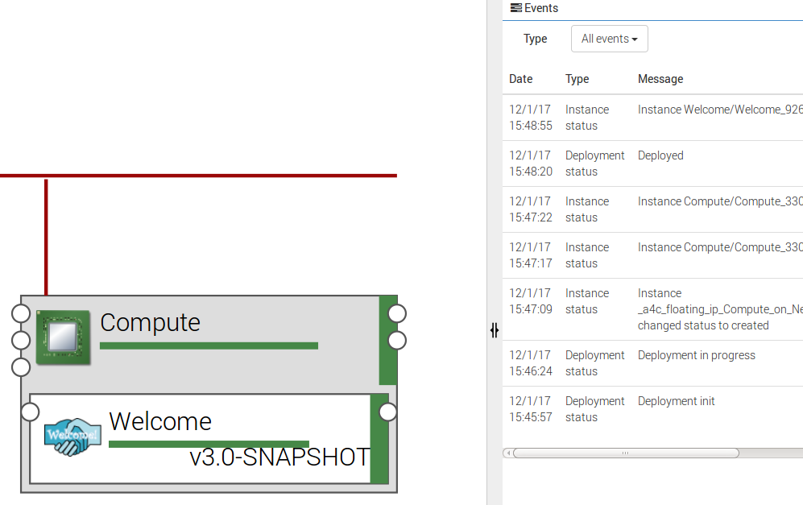

The last **Deployment status** message should indicate **Deployed**.

Test the application
--------------------

A simple test consists in displaying the Welcome message:
 
1. Get the **url** output property of the **Welcome** node, which is the Welcome Web service URL:

   - Click the **Topology** icon.

   - Select the Welcome node, and click the **Output properties** icon of the **url** attribute.

2. Go to the Welcome Web service URL:

   - Click the **Information** icon.

   - Click the **url** output property (in the form http://host:port/), as illustrated below:

.. image:: images/a4c_welcome_output_prop.png
   :scale: 100
   :align: center

The following message should be displayed:

   .. image:: images/bdcf_welcome_message.png
      :scale: 80

Un-deploying the application
----------------------------

You can **un-deploy**, **modify**, and **redeploy** your application:

Click the **Deployments** icon (on the left vertical bar), and perform the desired actions.

Enabling connection to a compute
================================

The Components catalog includes basic TOSCA components corresponding to computing resources:

- **Compute** : a VM that provides computing resources (memory, CPU). It can host any application.
- **Block Storage** : a persistent storage attached to a compute and providing a defined number of Giga Bytes of storage space.
- **Network** : a component connecting a compute node to a public network by allocating a public floating IP address to its VM.

To allow connection to the VM (represented by a compute node in the topology), a public IP must be allocated and associated with this VM.
To do this, drag and drop a **Network** component to your topology and attach it to the compute node using the **network** prerequisite.

The following figure shows a Compute with an attached Network:

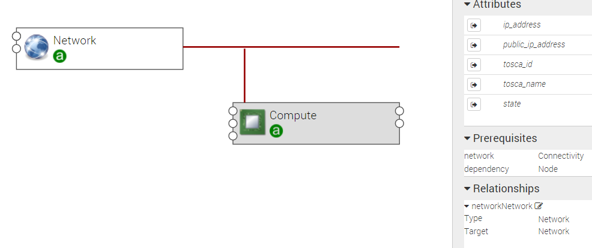

.. _getting_started_scalability_section:

Using Scalability
=================

Scalability properties
----------------------

Your application may need to scale-up to guarantee Quality of Service and/or High Availability.
The following properties can be set for scalability configuration:

- **max_instances**: maximum number of this compute that can be deployed
- **min_instances**: minimum number of this compute that can be deployed
- **default_instances**: number of instances of this compute that are initially deployed

.. _how_to_scale:

How to scale a node
-------------------

To configure a scalable compute, modify the properties (max_instances, min_instances, default_instances) of its **scalable** Capabilities, as illustrated below.

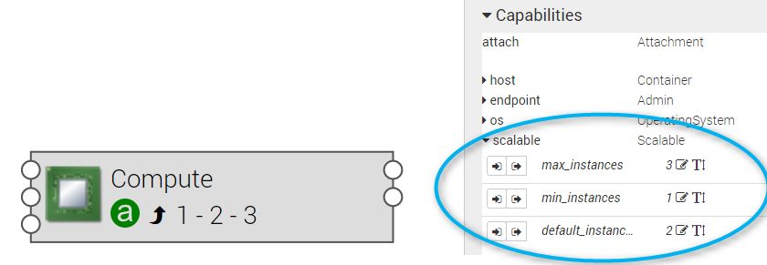

When your application is deployed, go to the **Runtime** view, select the compute to scale and modify the **Scale** value (2 in the following figure):

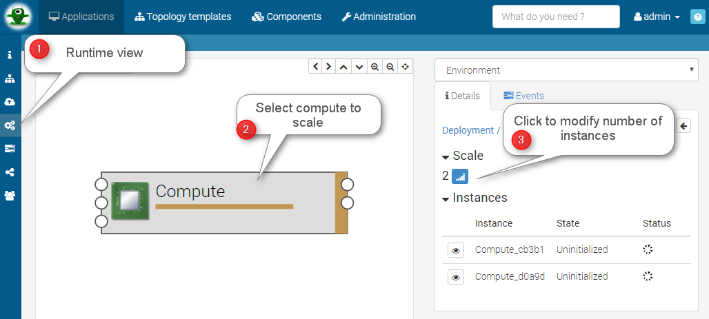

.. note:: Depending on the components hosted on the Compute node, the scaling operation might need some additional configuration. Moreover, certain components do not support dynamic scaling.

.. _getting_started_resilience_section:

Using Resilience
================

All the BDCF components are made to be resilient. This means that if any component of your application fails for some reason (network failure, hardware failure, VM crash, etc.), this component can be setup and run again as soon as possible. 

Refer to each component description to know more about its resilience.

.. warning:: The Cloudify version required by BDCF does not support self-healing. So, BDCF components in current version do not support this feature. This will be fixed in future versions.

Improving resilience with anti-affinity
---------------------------------------

Some components (Compute nodes) can be gathered into a TOSCA named group. A management policy can be associated with this group to act on the embedded nodes as a whole. Currently only the High Availability policy is supported in BDCF. This policy ensures the deployment of the compute nodes of the named group in different OpenStack availability zones.

Using BlockStorage to improve resilience
-----------------------------------------

To ensure data persistence even after a VM failure, a **BlockStorage** component can be attached to the Compute node. A BlockStorage represents a persistent storage device in the IaaS (a disk volume) identified by an ID.

Drag and drop a BlockStorage component to your topology and attach it to the Compute node using the **attachment** prerequisite.

To format the BlockStorage to a specific Linux file system, use a **LinuxFileSystem** component:

- Drag and drop a LinuxFileSystem component to the Compute node (use the **hostedOn** relationship). 
- Specify the mount point path in the **location** property.
- The software component can be connected to the LinuxFileSystem to get the value of the location property and use it in its configuration process.

The following figure shows a compute with an attached BlockStorage and hosting a **LinuxFileSystem**.

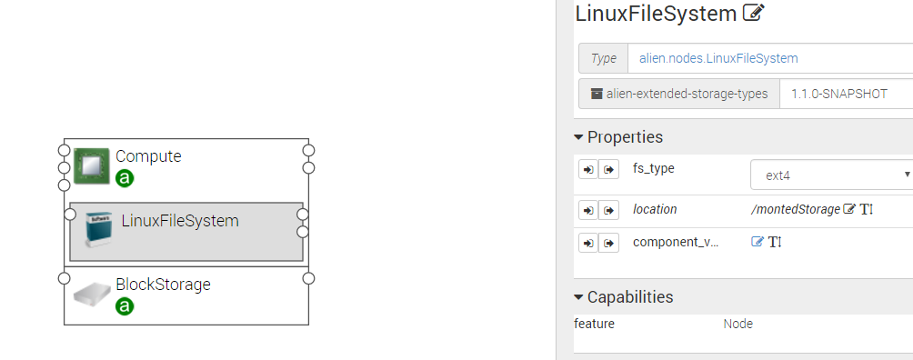

To deploy a compute node with a BlockStorage attached, it is necessary to configure a resource in the PaaS. Two types of resources are available, **Volume** and **DeletableVolume**.  A DeletableVolume is deleted if the application is undeployed, while a Volume can only be deleted manually by the IaaS administrator. The BlockStorage can be mapped to a Volume or a DeletableVolume at deployment.

Note that a volume is created in OpenStack and an ID is allocated to it at the first application deployment. You may set this ID in the **volume_id** property of the BlockStorage component to reuse the same volume in subsequent deployments.
The following figure shows how to specify a volume ID in Alien4Cloud.

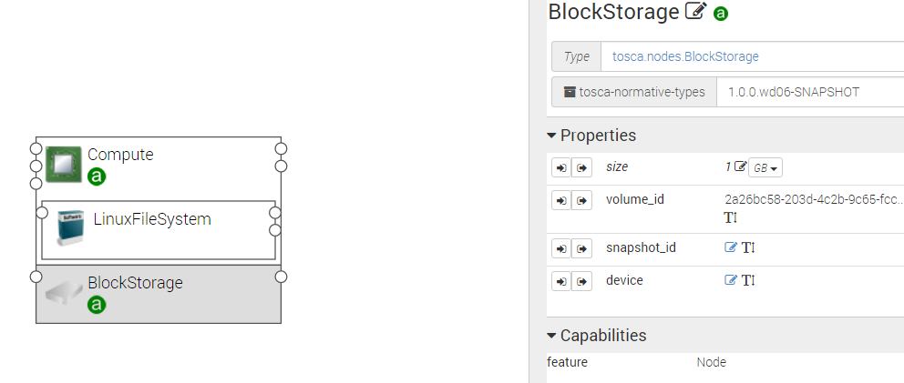
