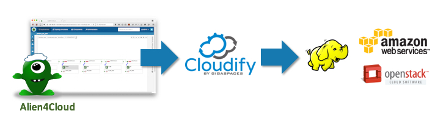
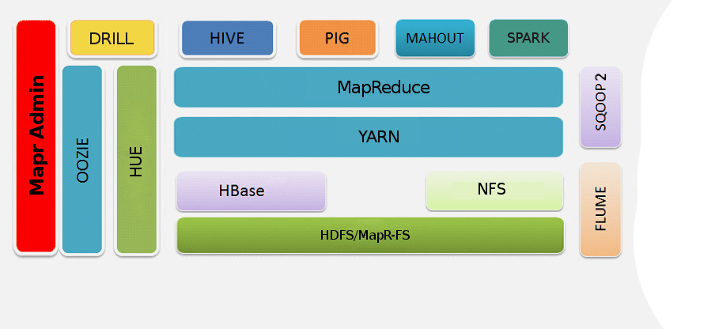
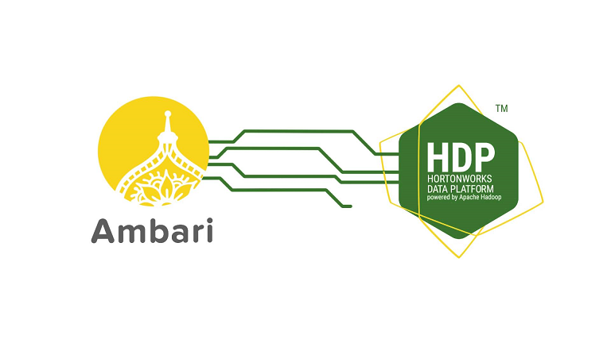
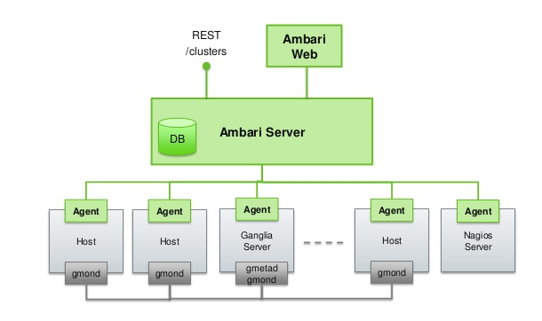
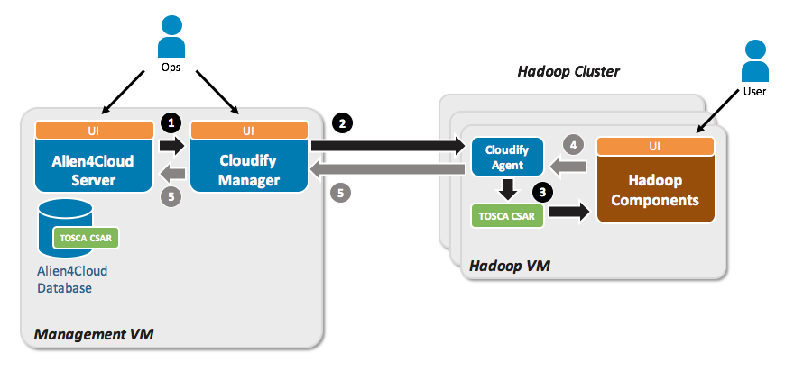

************
Introduction
************

.. contents::
	:local:
	:depth: 2

BDCF overview
===================

**Big Data Capabilities Framework** (**BDCF**) provides a packaged solution to create easily Big Data application clusters on demand.
Deployment of Big Data applications can be done on a public Cloud (such as Amazon), or on a private cloud (such as OpenStack), or on Bare-Metal.

Big Data applications targeted by BDCF are:

- mainly **Hadoop** applications based on MapR_, Hortonworks_ or Cloudera_.
- and **Log Analysis** applications based on Elastic_ Stack_ components.

In addition, BDCF provides useful components such as **SQL** and **Not Only SQL** database servers (MySQL_, MongoDB_, PostgreSQL_), message brokers (Kafka_), a data science development environment (RStudio_) and other
technical components such as **Java**, **Consul** (Consensus Systems), allowing detailed application architectures to be designed.

The components are connected together in application topologies. To simplify topology creation, BDCF provides **topology templates** that can be extended by your applications.

.. _Elastic: https://www.elastic.co/products
.. _Stack: https://www.elastic.co/products
.. _RStudio: https://www.rstudio.com/
.. _Consul: https://www.consul.io/
.. _MySQL: http://www.mysql.com/
.. _PostgreSQL: https://www.postgresql.org/
.. _MongoDB: https://www.mongodb.com/
.. _Cloudera: https://www.cloudera.com/ 

BDCF is based on the following products:

- Alien4Cloud_, the interface for end-users and administrators. It allows you to define application architectures to be deployed on any Cloud.
- Cloudify_, the engine to orchestrate application deployment. It works for many Clouds and for Bare-Metal.

.. _Cloudify: http://getcloudify.org/
.. _Alien4Cloud: http://alien4cloud.github.io/

The following figure shows the technologies used within BDCF.

Hadoop application components based on MapR
-------------------------------------------

BDCF provides the Hadoop MapR_ distribution containing the following Hadoop components:

.. _MapR: https://www.mapr.com

+----------------------------+-----------------+
| Component                  | Version         |
+============================+=================+
| MapR Administration        | 5.1             |
+----------------------------+-----------------+
| HDFS / MapR-FS             | 5.1             |
+----------------------------+-----------------+
| NFS                        | 5.1             |
+----------------------------+-----------------+
| HBase                      | 0.98.12         |
+----------------------------+-----------------+
| MapReduce                  | 2.0             |
+----------------------------+-----------------+
| YARN                       | 2.7.0           |
+----------------------------+-----------------+
| Pig                        | 0.15            |
+----------------------------+-----------------+
| Hive                       | 1.2             |
+----------------------------+-----------------+
| Mahout                     | 0.11            |
+----------------------------+-----------------+
| Spark                      | 1.5.2           |
+----------------------------+-----------------+
| Sqoop2                     | 2.0.0           |
+----------------------------+-----------------+
| Oozie                      | 4.2.0           |
+----------------------------+-----------------+
| HUE                        | 3.9.0           |
+----------------------------+-----------------+
| Drill                      | 1.8.0           |
+----------------------------+-----------------+
| Flume                      | 1.6.0           |
+----------------------------+-----------------+

Apache Ambari deploys Hortonworks Data Platform
-----------------------------------------------

**Apache Ambari** is the deployment tool for the Hadoop cluster technology called **Hortonworks Data Platform** (**HDP**).

BDCF provides a topology to size easily and flexibly an HDP Hadoop cluster.
With this topology, the administrator installs the Ambari management platform, which is used for installing, provisioning, managing, and 
monitoring HDP Hadoop clusters.

Topologies are also provided to deploy a complete Hadoop cluster from an Ambari blueprint file.

.. _Hortonworks: http://hortonworks.com/products/

+----------------------------+-----------------+
| Component                  | Version         |
+============================+=================+
| Apache Ambari              | 2.2.1.0         |
+----------------------------+-----------------+
| HDP                        | 2.4             |
+----------------------------+-----------------+

Components for Log Analysis applications
----------------------------------------

BDCF provides components to create Log Analysis applications based on an ELK_ stack (Elasticsearch_, Logstash_, Kibana_, Beats_) enriched by a Kafka_ broker for High Availability purposes.

.. _ELK: https://www.elastic.co/products
.. _Elasticsearch: https://www.elastic.co/products/elasticsearch
.. _Logstash: https://www.elastic.co/products/logstash
.. _Kibana: https://www.elastic.co/products/kibana
.. _Beats: https://www.elastic.co/products/beats
.. _Kafka: http://kafka.apache.org/

+----------------------------+------------------------+
| Component                  | Version                |
+============================+========================+
| Elasticsearch              | |elasticstack.version| |
+----------------------------+------------------------+
| Logstash                   | |elasticstack.version| |
+----------------------------+------------------------+
| Kibana                     | |elasticstack.version| |
+----------------------------+------------------------+
| Beats                      | |elasticstack.version| |
+----------------------------+------------------------+
| Kafka                      | 0.10.1.1               |
+----------------------------+------------------------+

Other Components provided by BDCF
---------------------------------

+----------------------------+-----------------+
| Component                  | Version         |
+============================+=================+
| Consul                     | 0.5.2           |
+----------------------------+-----------------+
| RStudio                    | 0.99.486        |
+----------------------------+-----------------+
| MongoDB                    | 3.2             |
+----------------------------+-----------------+
| MySQL community server     | 5.6             |
+----------------------------+-----------------+
| PostgreSQL community server| 9.2             |
+----------------------------+-----------------+
| HAProxy                    | 1.5             |
+----------------------------+-----------------+
| Flink                      | 1.1.3           |
+----------------------------+-----------------+
| Nutch                      | 1.12            |
+----------------------------+-----------------+
| Java                       | 6,7 or 8        |
+----------------------------+-----------------+
| XSF filesystem                               |
+----------------------------+-----------------+

Global architecture
===================

**Alien4Cloud** is the entry point to deploy a BDCF application.

Alien4Cloud includes the **TOSCA CSAR** archives containing all the scripts and certified **Topologies** to deploy a BDCF cluster (for example, a Hadoop cluster).

Alien4Cloud provides a **User Interface** (UI) to manage the deployment of BDCF clusters, the clusters lifecycle, access rights for deployment, etc.
From the UI, you can customize the deployment topology and add components.

Alien4Cloud does not perform the deployment; it only triggers the deployment order to Cloudify, which orchestrates all the deployment: Virtual Machine (VM) creation, BDCF components installation, monitoring, etc.

Deployment workflow
-------------------

The following figure shows the deployment workflow.

1. When the user launches the deployment in the Alien4Cloud UI, Alien4Cloud sends **TOSCA CSAR** and triggers the deployment order to **Cloudify Manager**.

2. Cloudify Manager finds or creates resources to deploy Big Data application: in the case of Bare-Metal it finds available servers, in the case of Cloud (IaaS) it creates the required VMs. Then it installs **Cloudify Agent** to communicate with Cloudify Manager, and sends the deployment order to all agents. Since Cloudify Manager orchestrates the deployment, it creates the VMs, and installs and starts the BDCF components in the correct order.

3. Cloudify Agent executes the scripts from **TOSCA CSAR** to install, configure and start the BDCF components.

At this point, the Big Data application is created and fully operational.
The next steps concern the monitoring of the application:

4. Cloudify Agent monitors the **SLA Components** to check if the cluster is started.

5. The monitoring status is sent to Cloudify Manager, then to Alien4Cloud to display the deployment status.

About TOSCA
-----------

TOSCA_ (Topology and Orchestration Specification for Cloud Applications) is a vendor-neutral standard defined by the OASIS consortium sponsored by big cloud industrial companies.
It aims enhance the portability and management of cloud applications and services across their lifecycle.

The TOSCA specification provides basic components that can be extended to provide application-centric components in a similar way to BDCF.

.. _TOSCA: http://docs.oasis-open.org/tosca/TOSCA/v1.0/os/TOSCA-v1.0-os.html

BDCF packaging and installation
===================================

BDCF package description
------------------------

The distribution package contains the following elements::

    bdcf
    |-- bdcf-topologies
    |-- bdcf-types
    |-- documentation
    |-- release-notes.txt
    |-- samples

- **bdcf-topologies**: BDCF end-to-end topology templates, which can be used for development or production applications. Refer to :ref:`Topologies<topologies_section>`.
- **bdcf-types**: TOSCA CSARs for BDCF components.
- **documentation**: zip files for HTML and PDF versions of this documentation.
- **release-notes**: Releases notes history.
- **samples**: Some CSARs samples used in this documentation (in :ref:`Getting Started<getting_started_section>` for instance).

BDCF package installation
-------------------------

BDCF requires several products (such as Alien4Cloud, Cloudify or OpenStack) to be installed and configured prior to its utilization. Refer
to :ref:`Requirements<getting_started_requirements_section>` for more information.

Then, BDCF components must be imported into Alien4Cloud in a specific order because there are dependencies between components. Refer to :ref:`Topologies<topologies_section>` for more information.

